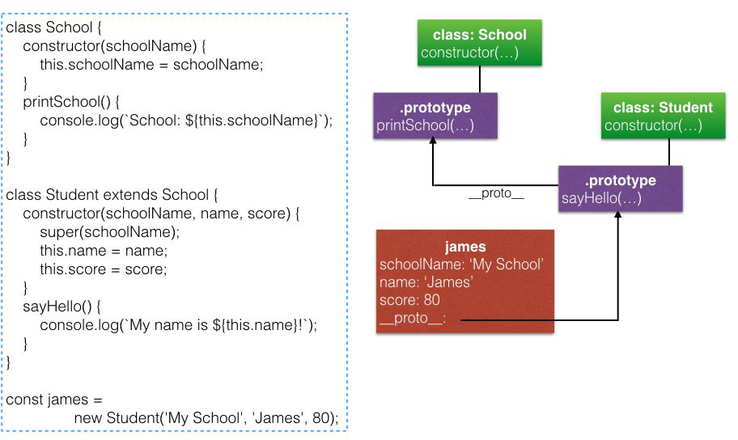

### MODULE #15
# Classes
講者: [wesbos](https://github.com/wesbos) - [ES6 for Everyone](https://es6.io/)

# Outline
* [Getter / Setter (ES5 ~ )](#getter-setter)
* [Say Hello to Classes](#intro)
* [Extending Classes and using super()](#extends)
* [Extending Arrays with Classes for Custom Collections](#array)

# Prior Knowledge
1. [Object-Oriented Javascript and Prototypal Inheritance](/JavaScript/Understanding the Weird Parts/4 - Object-Oriented Javascript and Prototypal Inheritance.md)
2. [Building Objects](/JavaScript/Understanding the Weird Parts/5 - Building Objects.md)

### <a name="getter-setter"></a>Getter / Setter (ES5 ~ )
`get` / `set`會將object property bind到指定的function，當取(`.`) / 設值(`=`)的時候呼叫

#### Getter ([doc](https://developer.mozilla.org/en-US/docs/Web/JavaScript/Reference/Functions/get))
Constructor Function:

```javascript
Student.prototype = {
    get info() { // .info在prototype object上
        return `Name: ${this.name}, Score: ${this.score}`;
    },
    ...
};
const james = new Student('James', 80);

james.info // "Name: James, Score: 80"，不是呼叫.info()而是直接取值
```

Object:

```javascript
const james = {
    name: 'James',
    score: 80,
    get info() { // .info在james object上
        return `Name: ${this.name}, Score: ${this.score}`;
    }
};

james.info // "Name: James, Score: 80"
```

#### Setter ([doc](https://developer.mozilla.org/en-US/docs/Web/JavaScript/Reference/Functions/set))
```javascript
// Constructor Function:
Student.prototype = {
    set group(name) {
        this.groupName = name.toLowerCase(); // 若不小心用this.group，會呼叫到setter本身而stack overflow
    },
    ...
};
const james = new Student('James', 80);

james.group = 'Group A' // 直接用setter = ...
james.groupName // "group a"

// 宣告在個別object的用法與getter相同，這邊略過
```

## <a name="intro"></a>Say Hello to Classes
1. `class`只是語法蜜糖，底層實作仍然是prototype的繼承體系
2. `class`是function object
3. 共有兩種宣告方式:

```javascript
// Declartion，這篇都以這種方式做範例
class Dog {
    ...
}

// Expression
const Dog = class {
    ...
};
```

### Example
下面`prototype`和`class`的方式完全對等

#### Constructor & Methods
```javascript
// Prototype
function Student(name, score) {
    this.name = name;
    this.score = score;
}
Student.prototype.sayHello = function() {
    console.log(`Hello, my name is ${this.name}!`);
}

// Class
class NewStudent {
    constructor(name, score) { // Shorthand method
        this.name = name;
        this.score = score;       
    } // 不需要,
    sayHello() {
        console.log(`Hello, my name is ${this.name}!`);
    }
}
```

#### Static Methods
不在`.prototype`上，在function本身，如`Array.from()`

```javascript
// Prototype
Student.printSchool = function(school) {
    console.log(`My School: ${school}`);
};

// Class
class NewStudent {
    ...
    static printSchool(school) {
        console.log(`My School: ${school}`);
    }
}
```

#### Getter / Setter
```javascript
// Prototype
Student.prototype = {
    get info() {
        return `Name: ${this.name}, Score: ${this.score}`;
    },
    ...
};

// Class
class NewStudent {
    ...
    get info() {
        return `Name: ${this.name}, Score: ${this.score}`;
    }
}
```

## <a name="extends"></a>Extending Classes and using super()
#### Properties
```javascript
class School {
    constructor(schoolName) {
        this.schoolName = schoolName;
    }
}

class Student extends School {
    constructor(name, score) {
        this.name = name; // Error，this is not defined
        this.score = score;
    }
}
```

在使用`new`建立`Student` object的時候會拋出error，原因是還沒有呼叫`super(...)`

```javascript
class School {
    constructor(schoolName) {
        this.schoolName = schoolName;
    }
}

class Student extends School {
    constructor(schoolName, name, score) {
        super(schoolName); // 相當於先呼叫School的constructor，然後將this指向回傳的object
        this.name = name;
        this.score = score;
    }
}
```

因此

```javascript
const james = new Student('My School', 'James', 80);

james // {schoolName: "My School", name: "James", score: 80}
// 三個properties都是在james object上 (hasOwnProperty為true)
```

#### Methods


## <a name="array"></a>Extending Arrays with Classes for Custom Collections
[Source Code](https://github.com/wesbos/es6.io/blob/master/15%20-%20Classes/extending-arrays-ANSWER.html)

```javascript
class MovieCollection extends Array {
    constructor(name, ...items) { // ...items: Array
      super(...items); // 等同於super(items[0], items[1], ...)
      this.name = name;
    }
    add(movie) {
      this.push(movie);
    }
    topRated(limit = 10) {
      return this.sort((a, b) => (a.stars > b.stars ? -1 : 1)).slice(0, limit);
    }
}

const movies = new MovieCollection('Wes\'s Fav Movies',
    { name: 'Bee Movie', stars: 10 },
    { name: 'Star Wars Trek', stars: 1 },
    { name: 'Virgin Suicides', stars: 7 },
    { name: 'King of the Road', stars: 8 }
);
movies.add({ name: 'Titanic', stars: 5 });
```
