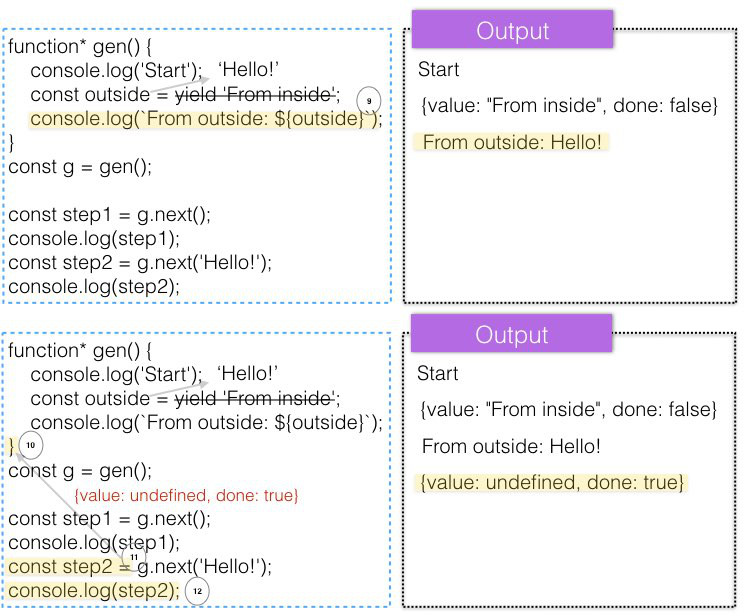

### MODULE #16
# Generators
講者: [wesbos](https://github.com/wesbos) - [ES6 for Everyone](https://es6.io/)

# Outline
* [Introducing Generators](#intro)
    * [Simple Example](#simple)
    * [`.next()`中可以傳argument給`yield`](#argument)
* [Using Generators for Ajax Flow Control](#pattern)

## <a name="intro"></a>Introducing Generators
* Generator Function

    可視為執行方式特殊的function，不像一般function一旦呼叫就會執行完
    
    Generator function可以在指定的位置 (使用keyword: `yield`) 先中斷，稍後再繼續執行
    
    ```javascript
    // Syntax: 在keyword: function後面加上"*"
    function* function_name(arg1, arg2, ...) {
        ...
        yield expression; // 中斷點
        ...
    }
    ```

* Generator Object

    ```javascript
    const gen = gen_function(); // Generator Object
    const result1 = gen.next(); // {value: result1, done: false}
    const result2 = gen.next();
    ...
    ```

    1. 呼叫generator function的時候並不會直接開始執行，而是返回一個generator object，需要用這個object的`.next()`來開始執行
    
    2. 一路跑到`yield`，停下來，做後面接的expression

        做完後將expression的result包裝成object，固定格式: `{value: result, done: true/false}`
        
        返回給呼叫`.next()`的地方
    
    3. 下次再呼叫`.next()`的時候，從上次的`yield`處繼續執行

### <a name="simple"></a>Simple Example
Example 1:

```javascript
function* listPeople() { // Generator Function
    yield 'James';
    yield 'Mark';
    
    return 'Finish'; // Optional
}

const people = listPeople(); // Generator Object

people.next() // {value: "James", done: false}
people.next() // {value: "Mark", done: false}
people.next() // {value: "Finish", done: true}，結束
people.next() // {value: undefined, done: true}，仍然可以呼叫
```

Example 2 (沒有明確宣告return):

```javascript
function* loop(arr) {
    for (const item of arr) {
        yield item;
    }
    // 沒有明確宣告return
}

const listPeople = ['James', 'Mark'];
const people = loop(listPeople);

people.next() // {value: "James", done: false}
people.next() // {value: "Mark", done: false}
people.next() // {value: undefined, done: true}，沒有明確宣告return，value為undefined
```

### <a name="argument"></a>`.next()`中可以傳argument給`yield`


6 ~ 7: 在從上次的`yield`執行前，先將`'Hello'`取代`yield` (expression已經不重要) 後繼續執行



## <a name="pattern"></a>Using Generators for Ajax Flow Control
這個pattern可以依序執行async function:

```javascript
function ajax(url) { // Async Function
    fetch(url)
        .then(data => data.json())
        .then(data => dataGen.next(data));
}

function* steps() {
    const data1 = yield ajax('https://jsonplaceholder.typicode.com/posts/1');
    console.log(data1);
    const data2 = yield ajax('https://jsonplaceholder.typicode.com/posts/2');
    console.log(data2);
    const data3 = yield ajax('https://jsonplaceholder.typicode.com/posts/3');
    console.log(data3);
}

const dataGen = steps();
dataGen.next(); // 開始執行
```


