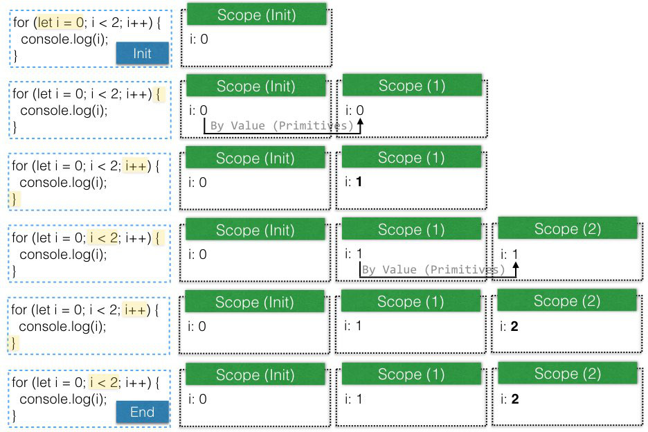
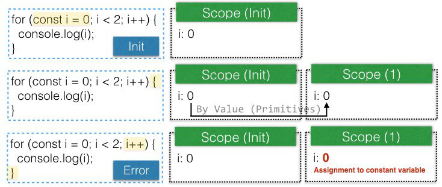

### ADDITIONAL
# var / let / const，在for Loop中的差異
在瞭解execution context以及variable的binding、life cycle等知識後，對`var` / `let` / `const`在:

1. [`for`](#for)
2. [`for...in` / `for...of`](#for_in)

的行為有點覺得容易混淆

由於沒有真正去trace JavaScript engine底層的實作方法，**以下為自己的觀察、猜測**

## <a name="for"></a>`for`
**先說結論: 用`let`**

* `var`

```javascript
for (var i = 0; i < 2; i++) {
  console.log(i);
}
```

1. 在當前execution context中執行`var i = 0`
2. 走一般for loop的流程
3. **整個for loop執行完後，會在當前execution context留下variable `i`，值為`2`**

* `let`

```javascript
for (let i = 0; i < 2; i++) {
  console.log(i);
}
```

1. 在當前execution context中，建立block scope，執行`let i = 0` (只存在這個scope)
2. 進入`{}`，建立block scope，將1.的`i`做為這個scope的`i`的初始值 (第2個scope)
3. 執行`{}`，完畢後做`i++`
4. 檢查`i < 3`，不成立
5. 進入下一次`{}`，將2.的`i`做為這個scope的`i`的初始值 (第3個scope)
6. 反覆直到for loop結束
7. **整個for loop執行完後，當前execution context不會有variable `i`**



**每個scope都有一個獨立的variable `i`**，這就是為什麼先前提過的例子:

```javascript
for (let i = 0; i < 3; i++) {
    setTimeout(() => console.log(i), 1000);
}
// Output: 0, 1, 2

for (var i = 0; i < 3; i++) {
    setTimeout(() => console.log(i), 1000);
}
// Output: 3, 3, 3
```

* `const`

```javascript
for (const i = 0; i < 2; i++) {
    console.log(i);
}
// TypeError: Assignment to constant variable.
```

原因是:




## <a name="for_in"></a>`for...in` / `for...of`
**先說結論: 沒有要在`{}`中改變走訪的value的話 (應該很少會這樣做)，用`const`，否則用`let`**

以下都用`for...of`做示範，先省略iterable、iterator的細節，只看variable的scope

* `var`

```javascript
for (var value of [10, 20]) {
  console.log(value);
}
```

**整個for loop執行完後，會在當前execution context留下variable `value`，值為`20`**

* `let`

```javascript
for (let value of [10, 20]) {
  console.log(value);
}
```

1. 在當前execution context中，建立block scope，執行`let value of [10, 20]` (取得iterator，只存在這個scope)
2. 從iterator取第一個值
3. 進入`{}`，建立block scope，2.的值做為這個scope的`value`的初始值 (第2個scope)
4. 執行`{}`，完畢後從iterator取下一個值
5. 進入`{}`，建立block scope，4.的值做為這個scope的`value`的初始值 (第3個scope)
6. 反覆直到iterator走訪完畢

**整個for loop執行完後，當前execution context不會有variable `value`**

* `const`

```javascript
for (const value of [10, 20]) {
  console.log(value);
}
```

基本和`let`相同，除非:

```javascript
for (const value of [10, 20]) {
    console.log(value);
    value++; // 試圖改變value的值
}
// TypeError: Assignment to constant variable.
```
