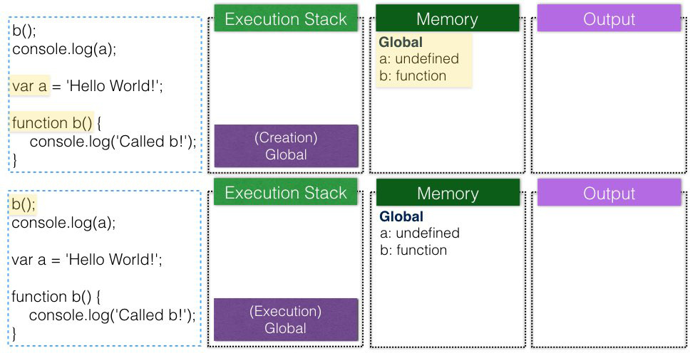
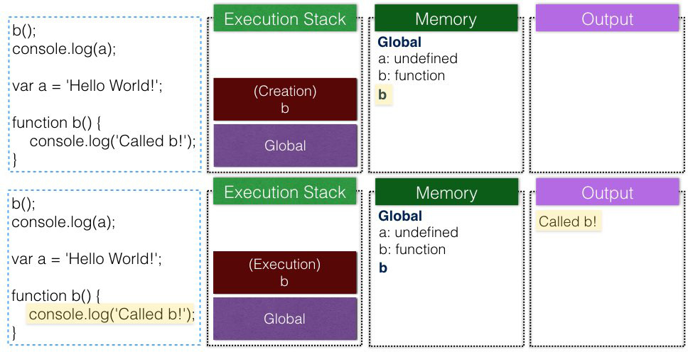
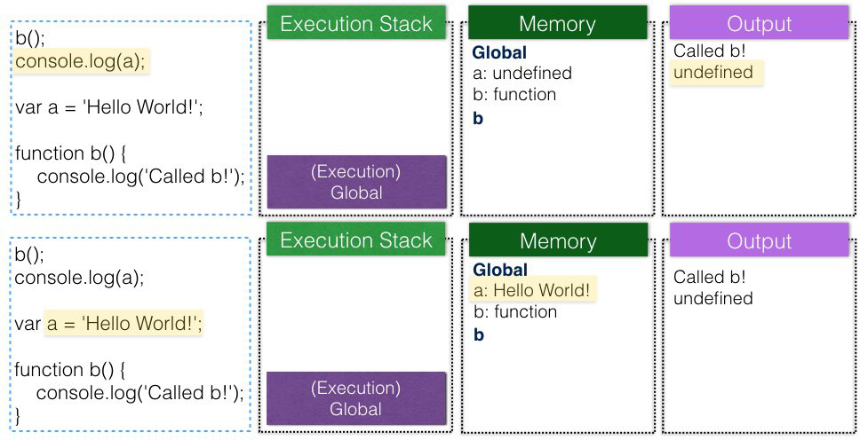

# Execution Contexts and Lexical Environments
from [JavaScript: Understanding the Weird Parts](https://www.udemy.com/understand-JavaScript/learn/v4/overview)

## Outline
* [Syntax Parsers / Lexical Environments / Execution Contexts](#sle)
* [Objects](#objects)
* [The Global Environment and The Global Object](#global)
* [The Execution Context - Creation and Hoisting](#execution-context)
    * [undefined](#undefined)
    * [Hoisting](#hoisting)
* [Scope Chain and Outer Environment](#outer-environment)
* [Single Threaded and Asynchronous Callbacks](#thread)
    * [Event-Driven / Event Loop](#event-loop)

## <a name="sle"></a>Syntax Parsers / Lexical Environments / Execution Contexts
這三個名詞對於理解JavaScript的運作原理非常重要，所以這邊先它們一個較整體的定義，之後會有許多例子來說明實際作用在什麼地方
### 1. Syntax Parsers

*__A program that reads your code and determines what it does and if its grammar is valid.__*
    
Your Code -> **Syntax Parsers (一個字一個字parse)** -> Computer Instructions

### 2. Lexical Environments (不是所有語言都用這種方式)

*__Where something sits "physically" in the code you write__*

白話一點說: Where your code's written and "what surrounds it"
    
例如下面這個case，以function `b`而言:

```javaScript
function a() {...}
function b() {...}
```
它的code在`Global` level中，跟它同level的有function `a`，而下面這個case:

```javaScript
function a() {
    function b() {...}
}
```
它的code在function `a`中

*__什麼是Global?__ -> Not Inside a Function*

### 3. Execution Contexts
*__A wrapper to help manage the code that is running__*
    
程式的進入點 (`Global`)，以及接下來每個執行到的function，都有自己的execution context (由JavaScript engine產生)

Execution context除了執行當前function的code以外，**還包含了一些其它的東西 (Global object, this, ...etc.)**

詳細參考: [Execution Context](#execution-context)


## <a name="objects"></a>Objects
這邊只先解釋什麼是JavaScript中的object

其它語言的object可能比較複雜，但是在JavaScript中，object很簡單就是**"A collection of name value pairs"**

## <a name="global"></a>The Global Environment and The Global Object
以在browser中為例，`Global Object`為window

且在`Global`的execution context，`this`指向`Global Object` (也就是window)

```javaScript
var a = 'Hello, world!';
function b() {...}
```

`a`跟`b`定義在`Global` execution context中 -> 被attach到`Global Object`

## <a name="execution-context"></a>The Execution Context - Creation and Hoisting
每個execution context可以分成兩個階段，Creation / Execution:


1. 在creation階段，JavaScript engine會建立此execution context的:
    * Global Object
    * this (比較複雜，這邊先略過)
    * [Outer Environment](#outer-environment)
    * 尋找此context中，所有的variables和functions，將memory space設起來
        * **Variables: 值一律為`undefined`** (包括`var a = function() {...}`的case)
        * **Functions: 標記為`function`**

2. 在execution階段，一行一行依序執行此context中的statements  

<a name="undefined"></a>*__什麼是undefined?__*

undefined是一個特別的keyword，會佔memory space，代表此變數還沒設值

```javaScript
var a;
console.log(a);

if (a === undefined) {
    console.log('a is undefined!');
} else {
    console.log('a is defined!');
}

// Output:
undefined
a is undefined!
```

**undefined不等於not defined (連宣告都沒有宣告)**

若呼叫not defined (連宣告都沒有宣告)的variable，會丟error

由於兩者意義不同，所以不要寫出像`a = undefined`這樣的code，應該要維持undefined本來的意義

不然在debug的時候，一個variable如果是undefined，會不好分辨到底是因為它還沒被設值，還是你把它設為undefined?

### <a name="hoisting"></a>Hoisting (Tip: 不要依賴hoisting來設計程式)
一般常見的解釋，所有variables和function的宣告，在實際執行時，都會被移動到context的最上面，但真的是code被"移動"嗎?

了解execution context的兩個階段行為後，hoisting就是件很當然的事情了，而**JavaScript engine並沒有真的將code往上移**



首先是`Global`的execution context被建立，放到stack中

在creation階段，variable `a`跟function `b`的memory space先被設起來 (值為`undefined`和`function`)

然後開始execution階段，跑到`b()`的時候，b的execution context被建立，放到stack中



b的creation階段，沒有任何的variables跟functions

開始execution階段，在console輸出"Called b!"

b的execution context結束，從stack裡pop出後，回到`Global`的execution context繼續執行



在console輸出variable `a`的值，此時為`undefined`

然後將`a`的值設為'Hello World!'

`Global`的execution context結束，從stack裡pop出後，stack空了程式結束

#### 若是`let`/`const`/`class`的case，它們有被hoisting嗎?
參考[stackoverflow](http://stackoverflow.com/questions/31219420/are-variables-declared-with-let-or-const-not-hoisted-in-es6)，它們有被hoisting，但是若將variable初始化的過程分成:

1. 配置variable名稱 (狀態為uninitialised，此時去access它的話就會丟error)
2. 將值設為undefined (狀態initialised，可以access)

可以想成`var`在creation階段做了這兩件事

但是像`let`的話，在creation階段只先配置variable名稱

只有在execution階段跑到`let`的statement的時候，才可以access

```javaScript
console.log(name); // ReferenceError
let name = "John";
```

## <a name="outer-environment"></a>Scope Chain and Outer Environment
### 怎麼判斷當前execution context的outer environment是誰?
從**lexical environment**來看，或者可以想成**who create me?**

Case 1:

```javaScript
function b() {...}
function a() {...}
```

`a`和`b`的outer environment都是`Global`

Case 2:

```javaScript
function a() {
    function b() {...}
}
```

`b`的outer environment是`a`，`a`的outer environment是`Global`

### Scope Chain
若當前execution context找不到variable，會去找它的outer environment

找不到的話會再去找outer environment的outer environment，直到`Global`也找不到的話，就會丟error

思考下面這個例子:

```javaScript
function b() {
    console.log(myVar);
}

function a() {
    var myVar = 2
    b();
}

var myVar = 1;
a();

// Output:
1
```

Output為1 (不是undefined也不是2)，詳細過程:


`a`的execution context沒有function `b`，所以它去找outer environment，也就是`Global`，找到`b`


`b`的execution context沒有variable `myVar`，所以它去找outer environment

同樣是`Global`，找到`myVar`，輸出在console，值為1

**若將程式改成:**


現在`b`的outer environment是`a`，找到`myVar`為2

**若將程式改成:**


現在`b`在outer environment`a`中找不到`myVar`，再往`a`的outer environment `Global`找到`myVar`為1

## <a name="thread"></a>Single Threaded and Asynchronous Callbacks
以在browser中執行為例，雖然browser不只做JavaScript這件事

但對JavaScript programmer來說，**JavaScript就是single thread**

JavaScript Engine只是browser中的一部分 (e.g. JavaScript, Rendering Engine, Http Request...etc.)

只有當JavaScript的整個execution stack為empty的時候 (**包括`Global` execution context**)

Event Queue中的event才會進到stack，執行特定區段的code (也就是callback，e.g. `clickHandler()`)

而當整個stack又empty後，下一個event才能進來，這種方式稱為:

### <a name="event-loop"></a>Event-Driven / Event Loop


此時stack還不為空，將`Callback2`加到callback queue


此時stack還不為空，將`Callback1`加到callback queue


全部做完，stack中的execution context已經全部pop (包括`Global` execution context)

搜尋callback queue中有沒有工作要做，找到`callback2`，`callback2`的execution context在stack中被建立


`callback2`做完，pop後stack為空

搜尋callback queue中有沒有工作要做，找到`callback1`，`callback1`的execution context在stack中被建立


`callback1`做完，pop後stack為空

搜尋callback queue中有沒有工作要做，callback queue也為空，程式結束

#### Callback在其它的execution context pop後，為什麼可以access outer environment的variables?
之後會再介紹**closures**的概念
