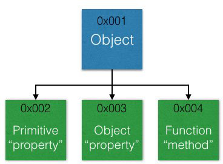
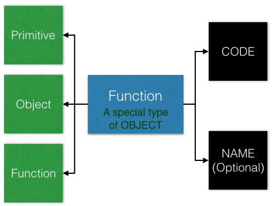
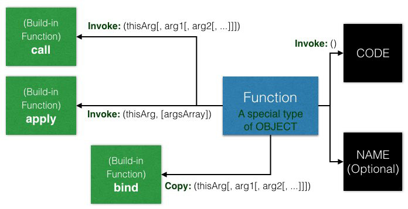
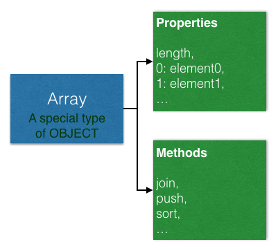

# Objects and Functions
from [JavaScript: Understanding the Weird Parts](https://www.udemy.com/understand-JavaScript/learn/v4/overview)

不像其它的語言，object和function在JavaScript的關聯性非常強 (在許多方面，甚至可以視為同一個主題)，因此這邊放到一起來學習

## Outline
* [Objects](#object)
    * [存取object的properties或methods](#access)
    * [Object Literals](#literals)
        * [Object Literals vs JSON](#vs-json)
* [Functions are Objects](#function)
    * [Function Statements and Function Expressions](#function-statement-expression)
* [By Value vs By Reference](#by-value-reference)
* [Objects, Functions, and `this`](#this)
    * [`Call`, `Apply` and `Bind`](#call-apply-bind)
* [Array](#array)
* [`arguments` and Spread (`...`)](#arguments-spread)
* [Function Overloading](#overloading)
* [Syntax Parsers and Automatic Semicolon Insertion](#syntax-parser)
* [Immediately Invoked Functions Expressions (IIFEs)](#iife)
* [Understanding Closures](#closure)

## <a name="object"></a>Objects
**Object的架構:**



一個object (name / value pairs)，本身在memory space中佔有空間(0x001)，可以持有property和method

* Property: 可以單純是primitive，或為另一個object
* Method: 由object持有的function稱為method

它們也會在在memory space中佔有空間(0x002 ~ 0x004)，object本身保存的是它們空間位址的**references**

### <a name="access"></a>存取object的properties或methods
有兩種方式 (都是operators，它們的precedence僅次於grouping):

1. Member Access (`.`)
2. Computed Member Access (`[...]`)

```javascript
var person = new Object(); // 這邊先暫時用new的方式宣告比較清楚，一般來說建議使用literal: {}
// 設值
person.firstname = "James";
person["lastname"] = "Yu";
// 取值
console.log(person.firstname);
console.log(person["lastname"]);
```

兩種方式基本上都可以，差別在於

**Member Access (`.`) 後面直接接"string"的properties name，不可接variable**

```javascript
// person: {firstname: "James", lastname: "Yu"}
var firstNameProperty = "firstname";
console.log(person.firstname); // James，等同於person["firstname"]
console.log(person.firstNameProperty); // undefined，等同於person["firstNameProperty"]
```

**Computed Member Access (`[...]`) 中可以是variable或expression**

```javascript
// person: {firstname: "James", lastname: "Yu"}
var firstNameProperty = "firstname";
console.log(person.firstNameProperty); // undefined，等同於person["firstNameProperty"]
console.log(person[firstNameProperty]); // James，等同於person["firstname"]
```

#### 注意nested properties容易發生類似NPE的error
```javascript
// person: {firstname: "James", lastname: "Yu"}
person.address = new Object(); // address是person的object property
person.address.city = "Taipei"; // 可以
```

拿掉`person.address = new Object();`

```javascript
// person: {firstname: "James", lastname: "Yu"}
person.address.city = "Taipei"; // Error，person.address是undefined，等同試圖存取undefined.city
```

### <a name="literals"></a>Object Literals

```javascript
// Object Literals: 建議使用
var person = { firstname: 'James', lastname: 'Yu'};
// 等同於
var person = new Object();
person.firstname = 'James';
person.lastname = 'Yu';
```

#### Faking Namespaces
*__Namespace: A container for variables and functions.__*

**JavaScript沒有namespace**，這是因為利用object就可以簡單做到

```javascript
// 衝突
var greet = 'hello';
var greet = 'hola';

// 改用object做為container
var english = {};
var spanish = {};
english.greet = 'hello';
spanish.greet = 'hola';

// 類似階層式的namespace
var chinese = {
  greetings: {
      basic: '嗨'
  }  
};
```

### <a name="vs-json"></a>Object Literals vs JSON
JSON (JavaScript Object Notation)，是以JavaScript的object literal syntax的概念設計

因此它們看起來非常像，但是**若誤會兩者是一樣的東西，容易發生問題**

**JSON可以想像成是object literal的subset** (JSON較嚴格)，也就是說，JSON可以，object literal也可以，但是反過來不一定

例如，JSON的name一定要用`""`包起來，JavaScript可接受但不一定要:

```javascript
// 符合JSON和JavaScript的標準
{
    "firstname": "James",
    "isAProgrammer": true
}
// 不符合JSON的標準，但是JavaScript的標準做法
{
    firstname: "James",
    isAProgrammer: true
}
```

**Object轉JSON**

```javascript
var person = {
    "firstname": "James",
    "isAProgrammer": true
}

var jsonString = JSON.stringify(person)); // string

```

**JSON轉Object**

```javascript
var jsonValue = JSON.parse('{ "firstname": "James", "isAProgrammer": true }') // object
```

## <a name="function"></a>Functions are Objects
*__First class function: Everything you can do with other types, you can do with function__*

Assign給variable，當成參數傳遞，使用literal syntax建立function等等。為[functional programming](https://en.wikipedia.org/wiki/Functional_programming)的重要特性

### Function的架構:


<font color="red">Function就是object</font>，除了一般object的特性外，多了兩種特別的properties:

1. **Name (optional):**

    若為匿名function的話可以沒有
    
2. **Code:**

    有個很重要的概念是，**所謂的function code就只是function object的其中一個property而已**

    而它是invocable的，也就是說我們可以透過`()`來呼叫，JavaScript engine會建立execution context執行放在其中的code

### <a name="function-statement-expression"></a>Function Statements and Function Expressions
*__Expression:__ A unit of code that results in a value.*

```javascript
// Expression
var a = 3; // return 3
1 + 2; // return 3，expression不一定要設值

// Statement
if (a === 3) {...} // if statement，單純執行工作，不return value (裡面的a === 3是expression)
```

由於function是object，因此可以透過function statement以及function expression兩種不同的方式來使用


注意像下面的case:

```javascript
// Function Statement
greet(); // hi

function greet() {
    console.log('hi');
}

// Function Expression
myGreet(); // Error: undefined is not a function

var myGreet = function() {
    console.log('hi');
}
```

這是因為execution context在creation階段的時候，function `greet`已經被定義

但variable`myGreet`在creation階段是`undefined`，所以在execution階段跑到`myGreet()`的時候就會丟error，若改成:

```javascript
var myGreet = function() {
    console.log('hi');
}
myGreet(); // hi，沒問題
```

#### Function Statements會被hoisting，並定義 (建立) function object
```javascript
function hello(name) {
   console.log('hello ' + name);
}

var a = hello('James');
```

在creation階段結束時:

* `a: undefined`
* `hello: function hello(name) { console.log('hello ' + name); }`

若是function expression，則在執行到該expression的時候function才被定義

## <a name="by-value-reference"></a>By Value vs By Reference
有些語言可以選，JavaScript沒得選

**Primitives就是by value / Objects就是by reference**


## <a name="this"></a>Objects, Functions, and `this`
如先前所提，每當invoke一個function的時候，新的execution context會被建立，放到execution stack

現在該來看看execution context中的**`this`**是什麼了

`this`指向什麼會由function的位置以及function是如何被invoked的來決定

### Global Level
```javascript
console.log(this); // window
```

```javascript
function a() {
    console.log(this); // window
}

var b = function() {
    console.log(this); // window
}

a();
b();
```

### Method Level
```javascript
var c = {
    name: 'The c object',
    log: function() {
        this.name = 'Update the c object';
        console.log(this); // this: object c
    }
}

c.log();
```

#### Example 1: Invoked的位置容易混淆
```javascript
var car = {
   name: 'Volvl',
   sayHello: function() { // 定義在car中
       return this;
   }
}
console.log(car.sayHello()); // Method Level, this: Object {name: 'Volvo' }

var myFunction = car.sayHello; // 等同於var myFunction = function() { return this; }
console.log(myFunction()); // 注意這邊: Global Level, this: window

var newCar = {
   name: 'Benz',
   sayHello: car.sayHello
}
console.log(newCar.sayHello()); // Method Level, this: Object {name: 'Benz' }
```

#### Example 2: 新增一個variable指向this:
```javascript
var c = {
    name: 'The c object',
    log: function() {
        this.name = 'Update the c object';
        console.log(this);
        
        var setname = function(newname) { // 注意，這個function不屬於method level
            this.name = newname; // 因此這裡的this: window (Global)
        }
        setname('Updated again! The c object'); // 變成window.name: 'Updated again! The c object'
        console.log(this); // this: object c，c的name沒有被改
    }
}

c.log();
```

**可以改成 (這個pattern非常常見):**

```javascript
var c = {
    name: 'The c object',
    log: function() {
        var self = this; // self指向object c，接下來我一律使用self就不用多去想this指向誰了
        
        var setname = function(newname) {
            self.name = newname;
        }
        setname('Updated again! The c object');
        console.log(self); // object c的name變成'Updated again! The c object'
    }
}

c.log();
```

*__Additional:__ `let` keyword可以解決這個問題而不需要多一層`self`，之後會提到*

### <a name="call-apply-bind"></a>call(), apply(), and bind()


這三個都是function object的build-in functions (methods)

**用來直接指定被invoked時，CODE裡面的`this`指向誰** (不用管是global level或屬於哪個method):

* `call` / `apply`

    差別只在於傳入的參數，`call`是各別傳，`apply`則是傳單一array，兩者呼叫後皆會直接invoke

* `bind`
    
    這個method**回傳的是function object的"copy"，而非直接invoke**

#### Example: Function Borrowing
```javascript
var person = {
    firstname: 'James',
    lastname: 'Yu',
    greeting: function(greet) {
        console.log(greet + ' ' + this.firstname + ' ' + this.lastname)
    }
}
person.greeting('Hello!'); // Hello! James Yu
``` 

```javascript
var newPerson = {
    firstname: 'Mark',
    lastname: 'Chen', 
}

// call, apply
person.greeting.call(newPerson, 'Hola!'); // invoke: Hola! Mark Chen
person.greeting.apply(newPerson, ['Hola!']); // invoke: Hola! Mark Chen

// bind
var copyGreeting = person.greeting.bind(newPerson); // 回傳的是function的copy，還沒有invoke
copyGreeting('Hola!'); // invoke: Hola! Mark Chen
```

#### Example: Function Currying
`bind`如果有參數，稱為function currying，等於在copy原function的時候**鎖定某些參數的值**

```javascript
function multiply(a, b) {
    return a * b;
}

var multipleByTwo = multiply.bind(this, 2);
// multipleByTwo等同於function multiply(2, b) { return 2 * b; }
console.log(multipleByTwo(4)); // 8

var multipleByThree = multiply.bind(this, 3);
// multipleByThree等同於function multiply(3, b) { return 3 * b; }
console.log(multipleByThree(4)); // 12
```

在這個例子中，我們只是要使用`bind`的參數的特性，`this`反而不重要所以直接給`Global`的`this`

**注意如果傳this到某個function，等同於把當下this所指對象的reference傳給該function，而不是該function在執行時的this**

所以上面這個例子，`multipleByTwo`的`this`永遠會是`Global`

在實際的應用上，還有一種常見的情況是某個function可能只接受固定長度參數的callback function，例如:

```javascript
function checkLimit(limiter, number) { // 兩個參數，但我們想借用這個function來作為filter function的callback
   return number > limiter;
}

var arr = [2, 4, 6];

console.log(arr.filter(checkLimit.bind(this, 3))); // [4, 6]
// 等同於console.log(arr.filter(item => item > 3)); // [4, 6]
```

## <a name="array"></a>Array
**Array和Function一樣都是特殊的object**

有別於一般的object使用name做為index來存取，array表現地像是使用number index來存取

### Array的架構:
其實是把element存成array object的property，index就是property name

並且額外擁有一些像是`join`、`push`之類的array methods



### JavaScript中沒有所謂關聯式陣列 (Associative Array: 使用name index的array)
Array永遠"只"使用number當作index

如果你設了name index，array內建的properties和methods可能導致非預期的結果 **(DO NOT do this!)**

```javascript
var arr = [1, 2];

arr["hello"] = "hi"; // 現在arr為[1, 2, hello: "hi"]
console.log(arr[0]); // 1
console.log(arr.hello); // hi
console.log(arr.length); // 2，而非3 (非預期)
console.log(arr.join()); // "1, 2"，而非"1, 2, hi" (非預期)

arr[2] = "hi"; // 現在arr為[1, 2, "hi", hello: "hi"]
console.log(arr.length); // 3，而非4 (非預期)
```

## <a name="arguments-spread"></a>`arguments` and Spread (`...`)
### `arguments`
*__Arguments: The parameters you pass to a function.__*

JavaScript gives you a **keyword of the same name** which contains them all.

```javascript
function myConcat() {
    if (arguments.length === 0) {
        console.log('Missing parameters!');
        return;
    }
    for (var i = 0; i < arguments.length; i++) {
        console.log(i + ": " + arguments[i]);
    }
}
 
myConcat("red", "orange", "blue");
// Output:
// 0: red
// 1: orange
// 2: blue
```

*__Note:__* `arguments`這個是"array-like"，而不是真正的array

它擁有number index和length等properties，但並沒有全部array的methods，所以不能做像是`arguments.join()`之類的array操作

*__Note:__* `arguments`在現行libraries中常用所以要了解，但ES6之後應該用spread (`...`)來代替

### Spread (`...`)
有兩種使用方法:

#### 1. 用在function的arguments中，取代`arguments`
```javascript
function log(first, second, ...others) {
    console.log(first);
    console.log(second);
    console.log(others.join(' and ')); // 就是array，可以使用array method
}

log('James'); // "James", undefined, ""
log('James', 'Mark', 'Tom', 'Jason'); // "James", "Mark", ["Tom", "Jason"]
```

#### 2. 用在array elements的展開
```javascript
var arr = ['James', 'Mark'];
console.log([arr, 'John']); // [['James', 'Mark'], "John"]
console.log([...arr, 'John']); // 使用spread: ["James", "Mark", "John"]
```

## <a name="overloading"></a>Function Overloading
**JavaScript沒有function overloading**，但是有許多方法可以做到類似的事情，以下為常見的pattern:

#### Example 1:
```javascript
function greet(firstname, lastname, language) {
    language = language || 'en';
    
    if (language === 'en') {
        console.log('Hello ' + firstname + ' ' + lastname);   
    }
    if (language === 'es') {
        console.log('Hola ' + firstname + ' ' + lastname);   
    }
}

function greetEnglish(firstname, lastname) {
    greet(firstname, lastname, 'en');   
}

function greetSpanish(firstname, lastname) {
    greet(firstname, lastname, 'es');   
}

greetEnglish('James', 'Yu'); // Hello James Yu
greetSpanish('Mark', 'Chen'); // Hola Mark Chen
```

#### Example 2: Function Factories (利用[closure](#closure))
```javascript
function makeGreeting(language) {
    return function(firstname, lastname) {
        if (language === 'en') {
            console.log('Hello ' + firstname + ' ' + lastname);   
        }
        if (language === 'es') {
            console.log('Hola ' + firstname + ' ' + lastname);   
        }
    }
}

var greetEnglish = makeGreeting('en');
var greetSpanish = makeGreeting('es');

greetEnglish('James', 'Yu'); // Hello James Yu
greetSpanish('Mark', 'Chen'); // Hola Mark Chen
```

## <a name="syntax-parser"></a>Syntax Parsers and Automatic Semicolon Insertion
這邊給一個簡單的概念說明syntax parsers的工作，對於了解下面的內容有幫助

我們寫好的code並不是在computer上真正執行的樣子，而是由syntax parsers先做類似翻譯的動作

#### Syntax Parsers:
**一個一個character依序讀取**你的code，依照事先定義好的規則，決定:

1. 是否為valid syntax，否則丟error
2. 根據你的意圖，做相對應的處理 (**有可能在code真正執行前改變它**)

###  Dangerous Aside: Automatic Semicolon Insertion
JavaScript engine會根據規則，在適當的地方補上`;`

像是若這邊只有`return`，換行字元會被取代成`;` -> `return;`

有時候會導致一些意外的情況，例如:

```javascript
function getPerson() {
    return
    {
        firstname: 'Tony'
    }
}

console.log(getPerson()); // undefined，為什麼?
```

這是因為`return`後面被自動補了`;`，若改成:

```javascript
return { // return後面不再直接接換行符號
        firstname: 'Tony'
}
```

就可以正常work

## <a name="iife"></a>Immediately Invoked Functions Expressions (IIFEs)
### 鋪陳一: 

```javascript
// Function Expression
var myGreet = function(name) { // 這個function在execution時才會建立
    console.log('Hello ' + name);
}
myGreet('James');
```

在**execution階段**，function object create完後**立即執行 (使用`()`)**

```javascript
var myGreet = function(name) {
    return 'Hello ' + name;
}('James');
console.log(myGreet);
```

執行順序:

1. 建立function: `function(name) { ... }`
2. 使用`('James')`來invoke並傳入parameter，function做完回傳 `'Hello James'` (string)
3. Assign `'Hello James'`給variable `myGreet`
4. 在console輸出`myGreet`，也就是`'Hello James'`

### 鋪陳二:
現在我們想將`var myGreet`拿掉，先簡短複習一下expression:

```javascript
3; // ok，return 3
"James"; // ok，return "James"
{ name: "James" }; // ok，return { name: "James" }
```

沒問題，expression不一定要設值 (e.g. `var a = ...`)，可以單獨存在，但是

```javascript
function(name) {
    return 'Hello ' + name;
}; // Error，Unexpected token (
```

為什麼? 因為**syntax parser在一行的開始，若看到`function` keyword，會預期這是一個function statement**，然後它發現後面沒有馬上接著function name，就判斷是invalid syntax

想要讓syntax parser知道這是一個function expression，使用`()` operator包起來

**因為`()` operator裡面包的一定是expression，我們不會在裡面放statement**，所以:

```javascript
(function(name) {
    return 'Hello ' + name;
}); // 沒問題，現在這個function被當成expression，return這個function
```
### 結論: Immediately Invoked Functions Expressions (IIFEs)

```javascript
(function(name) {
    console.log('Hello ' + name);
})('James'); // IIFE: 立即invoke這個return的function，並傳入paremeter

// Output:
Hello James
```

也把invoke放在裡面，寫成 (看個人風格):

```javascript
(function(name) {
    console.log('Hello ' + name);
}('James'));
```

### 好處: Safe Code
```javascript
var greeting = 'Hola ';
(function(name) {
    var greeting = 'Hello '; // 更改
    console.log(greeting + name);
})('James'); // Hello James

console.log(greeting); // 仍然為'Hola '
```

`Global`的execution context內: `greeting: 'Hola'`

執行到IIFEs的時候，在stack中建立一個新的匿名execution context，在裡面宣告的variables和functions獨立於上一層的的context，並在pop出stack的時候被回收

這讓code更加清楚以及安全，但若我們想在IIFEs中，更改其它context內的variables呢?

```javascript
var greeting = 'Hola ';
(function(global, name) { // 使用context的reference
    var greeting = 'Hello ';
    global.greeting = 'Hello '; // 更改
    console.log(greeting + name);
})(window, 'James'); // 傳入Global context

console.log(greeting); // 'Hello '
```

## <a name="closure"></a>Understanding Closures
Closure是JavaScript中最容易讓人混淆的部分，要了解它的運作，需要對execution context、function、value vs reference等等都有一定的認識。這邊會用幾個例子解釋closure以及複習前面的topics

先來一個最基本的case看看什麼是closure:

### Simple Case
```javascript
function greet(myGreet) {
    return function(name) {
        console.log(myGreet + name);
    }
}
var greeting = greet('Hello ');
greeting('James'); // 'Hello James'
```

#### Think
當執行到`greet('Hello ')`的時候，function `greet`建立一個execution context，包含了傳入的參數`myGreet: 'Hello '`

然後回傳一個匿名function後結束 (execution context從stack pop出去)

繼續執行`greeting('James')`，建立execution context來做`console.log(myGreet + name)`

但是此時持有`myGreet: 'Hello '`的context已經不在stack中了，為什麼可以正常運作呢?

#### Reason
原因就是**function被建立的時候，就會持有建立它的execution context的reference**

即使execution context已經從stack中pop出去，function仍然可以access到該context，**就好像把function建立時的環境給"封"進來一樣**


這邊雖然建立匿名function的`greet`的execution context已經從stack pop出去

該function仍然保持對它的reference，因此在memory space中沒有被GC


### Example 1: For loop


### Example 2: 利用closure改變傳入的object
#### Case 1


#### Case 2 (錯誤示範)


這邊`myObj = { greet: 'After' };`的時候，並沒有改到原object，而是指向新的object


### Example 3: Callback
順便複習之前event loop的概念


這邊的重點是:

1. `setTimeout`都做完，`Global` context就pop了，並不是等在那邊

    Execution stack清空後，callback才能進來，整個程式直到execution stack和callback queue都為空才結束

2. Callback function雖然一跑到`setTimeout`時就已經建立，但裡面的code要直到執行的時候才會跑

    一開始想用primitive type的特性把`Global`的`greeting: 'Hi!'`給cache起來

    就在callback function中寫`var myGreet = greeting;`，結果失敗
    
    跑到的時候`greeting`已經是`'Hello!'`
