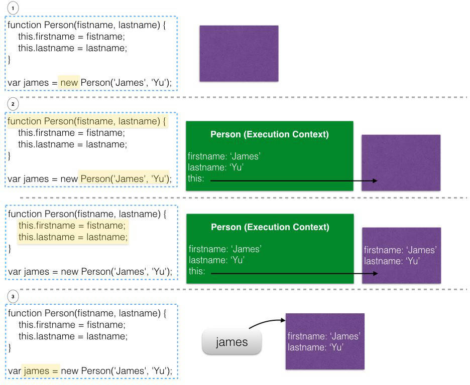
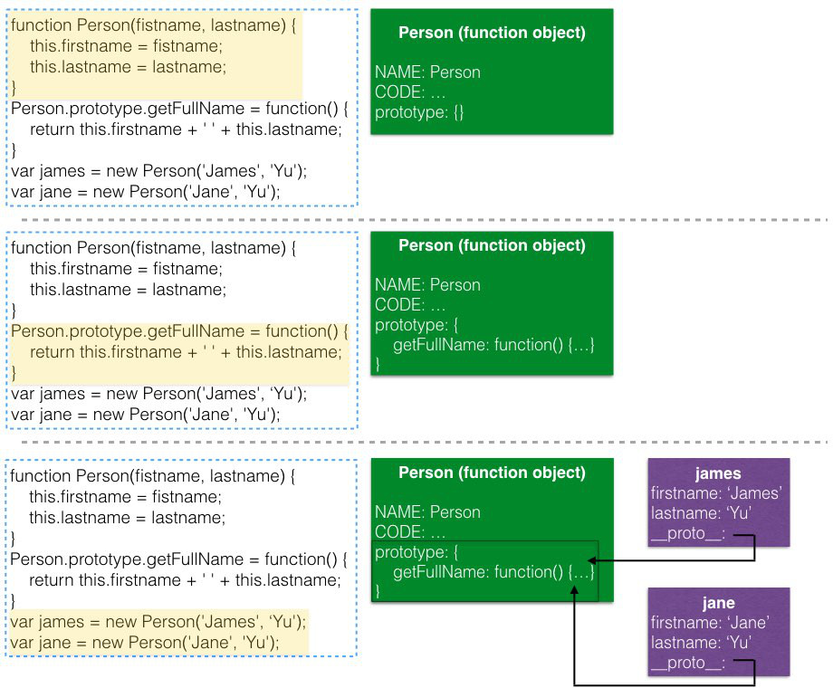
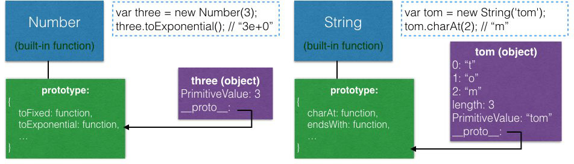
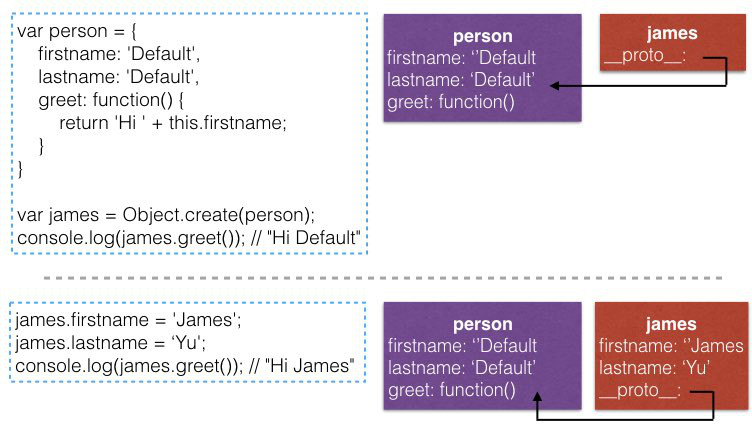
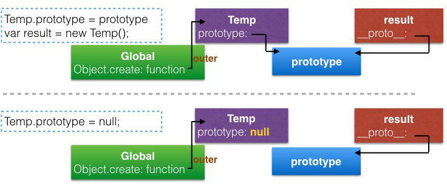

# Building Objects
from [JavaScript: Understanding the Weird Parts](https://www.udemy.com/understand-JavaScript/learn/v4/overview)

## Outline
* [Function Constructors, 'new', and the History of Javascript](#new)
* [Function Constructors and '.prototype'](#prototype)
* [Built-In Function Constructors (`Number`, `String`...etc.)](#built-in)
* [`for...in`](#for-in)
    * [Enumerable Properties](#enumerable)
* [Object.create and Pure Prototypal Inheritance](#object-create)
* [ES6 and Classes](#class)

## <a name="new"></a>Function Constructors, 'new', and the History of Javascript
#### History
除了object literal以外，keyword [`new`](https://developer.mozilla.org/en-US/docs/Web/JavaScript/Reference/Operators/new)也可以用來建立object，它是一個operator，在設計上**模仿了Java、C#等語言**建立instance的方式，來吸引其它語言的developer

#### Operator: `new`
1. 建立一個empty object: {}
2. 執行`new`後面的funciton (我們會稱這個function為constructor function，但**本質它一樣是function object，運作方式也相同**)

    在執行constructor function的時候，**將`this`指向empty object**
    
3. 若constructor function中沒有`return` statement，自動return empty object



## <a name="prototype"></a>Function Constructors and '.prototype'
如果我們看上面例子中的`james.__proto__`，會發現它的reference已經被自動設好，原因是:

1. 之前沒有提過，其實所有function object都有一個`prototype` property，預設值為empty object

    *__Note:__ 不要跟每個object的`__proto__` property混淆*
    
2. 這個property只有在function被當作constructor使用 (跟在`new`後面)的時候，才有實際作用

3. 由function constructor所**`new`出來**的objects，它們的`__proto__`會自動指向constructor的`prototype` property



#### 為何methods不直接放在constructor function中?
以上面的例子，constructor function若改寫成

```javascript
function Person(fistname, lastname) {
    this.firstname = fistname;
    this.lastname = lastname;
    this.getFullName = function() {
        return this.firstname + ' ' + this.lastname;
    };
}
```
也是有相同的結果，但是每次`new`出新的`Person` instances的時候，各個instance都會持有一份`getFullName` function的copy，會造成效能上的浪費

**因此我們一般會把method放在`.prototype`，這樣不論`new`出了多少個object，都會指向同一份method**

#### 忘記`new`會怎樣?

```javascript
var james = Person('James', 'Yu'); // Person被當成一般function執行 -> 回傳undefined
console.log(james.getFullName()); // undefined.getFullName() -> Error
```

在語法上完全合法，但並不是我們預期的

所以慣例上我們在命名constructor function的時候，**首字會用大寫**來讓code更清楚

此外，有些tool可以檢查到大寫開頭的function，沒有使用`new`的話提出警告


## <a name="built-in"></a>Built-In Function Constructors (`Number`, `String`...etc.)


以`Number`為例，它是個built-in的function，作為constructor使用的時候，其實就是在建立primitive `number`的wrapper **object**，而`__proto__`指向的`Number.prototype`有許多定義好的methods可供使用

### Wrapper object不再是primitive
```javascript
var a = 3;
var b = new Number(3);

a == b // true (經由coercion)
a === b // false (b是object，而非primitive)
```

### 這些methods是定義在built-in function的`.prototype`
Wrapper object透過`__proto__`呼叫這些methods

```javascript
// Number
Number.prototype.hasOwnProperty('toFixed') // true
Number.hasOwnProperty('toFixed') // false

// Function
Function.prototype.hasOwnProperty('call') // true
Function.hasOwnProperty('call') // false
```

### Auto boxing (`String`)
`"James".length`會return 5，是因為auto boxing，engine自動做了`new String("James").length`

**其它built-in function沒有auto boxing:**

```javascript
3.isPositive() // Error
var a = new Number(3);
a.isPositive() // ok
```

### 添加自定methods
```javascript
String.prototype.isLengthGreaterThan = function(limit) {
    return this.length > limit;
}

console.log("John".isLengthGreaterThan(5)); // false
```

**注意不要override已經定義好的built-in methods (engine允許但不好)**

```javascript
"James".endsWith("s") // true

// Override
String.prototype.endsWith = function() { return "hello"; }
"James".endsWith("s") // "hello"
```

### function call vs function constructor
以`Number`為例，若當作一般function使用 (沒有`new`)，是將傳入的parameter轉換成primitive `number`後回傳

```javascript
Number("3"); // primivite number 3
new Number("3"); // Number object, 保存的值為3
```

### 一般來說，平常實作不需特別使用built-in function來處理primitive types
除非有需要，並且很清楚built-in function的運作方式 (例如上面單純用來轉換`string` -> `number`)

*__Additional:__ 在處理`Date`的時候，講者推薦使用[Moment.js](http://momentjs.com/)*

## <a name="for-in"></a>`for...in`
`for...in`會走訪所有object中**"enumerable"**的properties (**包含繼承來的**)

```javascript
var james = {
    firstname: 'James',
    lastname: 'Yu'
}

var address = {
    city: 'Taipei'
}

james.__proto__ = address; 
for (prop in james) {
    console.log(`${prop}: ${james[prop]}`);
}

// Output
firstname: James
lastname: Yu
city: Taipei
```

### <a name="enumerable"></a>Enumerable Properties
每個property內部其實都有一個`Enumerable` flag，預設為`true`

這些properties會在`for...in`或是`Object.keys(o)`中出現

*__Note:__ 其實不只這兩種function，很多API doc都會提到是否針對enumerable properties，例如[`JSON.stringify`](https://developer.mozilla.org/en-US/docs/Web/JavaScript/Reference/Global_Objects/JSON/stringify)*

若想要將property的`Enumerable` flag設為false，需要特別使用[`Object.defineProperty`](https://developer.mozilla.org/en-US/docs/Web/JavaScript/Reference/Global_Objects/Object/defineProperty)

```javascript
var james = {
    firstname: 'James',
    lastname: 'Yu'
}

var address = {
    city: 'Taipei'
}
// 在address上定義一個non-enumerable的property -> country: Taiwan
Object.defineProperty(address, 'country', { value: 'Taiwan', enumerable: false});
console.log(address); // {city: "Taipei", country: "Taiwan"}

james.__proto__ = address; 
for (prop in james) {
    console.log(`${prop}: ${james[prop]}`);
}

// Output
firstname: James
lastname: Yu
city: Taipei
// 沒有country: Taiwan
```

### Array and `for...in`
如上所提，`for...in`會尋訪所有enumerable properties，所以若在array中使用:

```javascript
Array.prototype.myCustomFeature = 'cool!';
var arr = ['John', 'Jane', 'Jim'];

for (var prop in arr) {
    console.log(prop + ': ' + arr[prop]);
}

// Output:
0: John
1: Jane
2: Jim
myCustomFeature: cool! // Enumerable
```

就會出現問題，應該使用`length`的方法，或是ES6以後:

1. [`for...of`](https://developer.mozilla.org/zh-TW/docs/Web/JavaScript/Reference/Statements/for...of)
2. [`Array.prototype.forEach()`](https://developer.mozilla.org/en-US/docs/Web/JavaScript/Reference/Global_Objects/Array/forEach)

## <a name="object-create"></a>Object.create and Pure Prototypal Inheritance
另一種建立繼承關係的object的方法，`Object.create`簡單明確地實踐了JavaScript設計prototype的概念

(pure prototypal inheritance，不像`new`或`class`是為了吸引其它語言的developer)



### Polyfill
*__Polyfill:__ Code that adds a feature which the engine MAY lack*

MDN版本 (可以在`Object.create()的時候直接傳入properties`):

```javascript
if (typeof Object.create != 'function') { // 先檢查Object.create存不存在
  Object.create = (function(undefined) { // 不存在的話建立
    var Temp = function() {}; // 先建立一個臨時的空function，等等用來new新object
    return function (prototype, propertiesObject) {
      if(prototype !== Object(prototype) && prototype !== null) { // prototype可以是object或null
        throw TypeError('Argument must be an object, or null');
      }
      Temp.prototype = prototype || {}; // 將空function的prototype設起來
      if (propertiesObject !== undefined) { // 有傳properties的話也設起來
        Object.defineProperties(Temp.prototype, propertiesObject);
      } 
      var result = new Temp(); // 用空function建立新object (__proto__指向Temp.prototype)
      Temp.prototype = null;
      if(prototype === null) { // 處理prototype是null的case
         result.__proto__ = null;
      } 
      return result; // 回傳新object
    };
  })();
}
```

拆解:

* `var Temp = function() {};`放在return function外

    可以避免每次呼叫`Object.create`都重新建立一個新的`Temp` function
    
* `prototype !== Object(prototype)`

    用來檢查`prototype`是不是object (非primitive):

```javascript
Object(13) // function call，return Number(13)
Object(13) !== 13 // false

var a = { greet: 'hello' }
Object(a) === a // true
```

* `Temp.prototype = null;`

    讓`Temp`建立出的object，在不需要的時候可以正常被GC
    
    

## <a name="class"></a>ES6 and Classes
其它語言: `class` 並不是真正的object instance，而是template的概念

但在JavaScript中，`class`就是object:

```javascript
class Person { // 這就是一個object
    constructor(firstname, lastname) {
        this.firstname = firstname;
        ...
    }
    
    greet() {
        return 'Hi ' + firstname;
    }
}
```

ES6的`class`、`extend`等，都是語法蜜糖，底層的概念仍然是`__proto__`和`.prototype`

例如`extends`就相當於設定`__proto__`的reference

*__Additional:__ 講者不喜歡`new`跟`class`等等，它們都只是模仿其它語言的語法蜜糖，真的要使用的話，最重要的是瞭解到其實底層的運作是一樣的*
