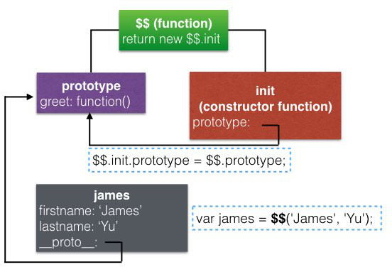

# Deep Dive into Source Code: jQuery
from [JavaScript: Understanding the Weird Parts](https://www.udemy.com/understand-JavaScript/learn/v4/overview)

## Outline
* [用IIFEs將jQuery append到global](#append-global)
* [不使用"new" keyword來建立jQuery object](#no-new)
* [在constructor function中使用return，先交由另一個function做處理再return](#return-constructor)
* [alias](#alias)
* [將另一個library包進來](#library)
* [Method Chaining](#method-chaining)

## <a name="append-global"></a>用IIFEs將jQuery append到global
```javascript
( function( global, factory ) {
	// 處理NodeJS的case
	// ...
	} else {
		factory( global ); // 將jQuery append到global
	}
} )( typeof window !== "undefined" ? window : this,
    // factory function，主要的code都在這裡面
    function() {...});
```

## <a name="no-new"></a>不使用`new` keyword來建立jQuery object
架構:

```javascript
function Person(firstname, lastname) {
    this.firstname = firstname;
    this.lastname = lastname;
}
Person.prototype.greet = function() {
    console.log('Hello! ' + this.firstname + ' ' + this.lastname);
};

var james = new Person('James', 'Yu'); // 若我們不想用new來建立Person
james.greet();
```

可以用這個pattern:

```javascript
var $$ = function(firstname, lastname) {
    return new $$.init(firstname, lastname);
}

$$.prototype = {
    greet: function() {
        console.log('Hello! ' + this.firstname + ' ' + this.lastname);
    }
};

$$.init = function(firstname, lastname) {
    this.firstname = firstname;
    this.lastname = lastname;
}
$$.init.prototype = $$.prototype;

var james = $$('James', 'Yu'); // 現在我們可以用$$來建立person object
james.greet();
```



jQuery:

```javascript
jQuery = function( selector, context ) {
    return new jQuery.fn.init( selector, context );
}
```

```javascript
jQuery.fn = jQuery.prototype = { // alias
    // function都放這
}
```

```javascript
jQuery.fn.init = function( selector, context, root ) { // constructor function
    // ...
	return jQuery.makeArray( selector, this ); // 在constructor function中使用return
};
init.prototype = jQuery.fn;
```

## <a name="return-constructor"></a>在constructor function中使用return，先交由另一個function做處理再return
```javascript
jQuery.fn.init = function( selector, context, root ) {
	return jQuery.makeArray( selector, this ); // 重點是這個this
};
```

這邊`this`指的是做為constructor function時建立的`{}`，所以這邊是將本來已經要自動return的`{}`

**交給`makrArray`處理後再return**

## <a name="alias"></a>alias
```javascript
window.jQuery = window.$ = jQuery // alias
```

## <a name="library"></a>將另一個library包進來
同樣是IIFEs:

```javascript
var Sizzle = (function( window ) {
    function Sizzle() {
        // Sizzle的code
    }
    return Sizzle;
})( window );
```

使用:

```javascript
jQuery.find = Sizzle;
jQuery.expr = Sizzle.selectors;
```

## <a name="method-chaining"></a>Method Chaining
*Calling one method after another, and each method affects the parent object.*

```javascript
jQuery.fn.extend( {
	addClass: function( value ) {
		// ...
		return this; // Method Chaining
	},

	removeClass: function( value ) {
		// ...
		return this; // Method Chaining
	},
	// ...
});
```

使用:

``` javascript
var q = $("ul.people").addClass("newclass").removeClass("people");
```
