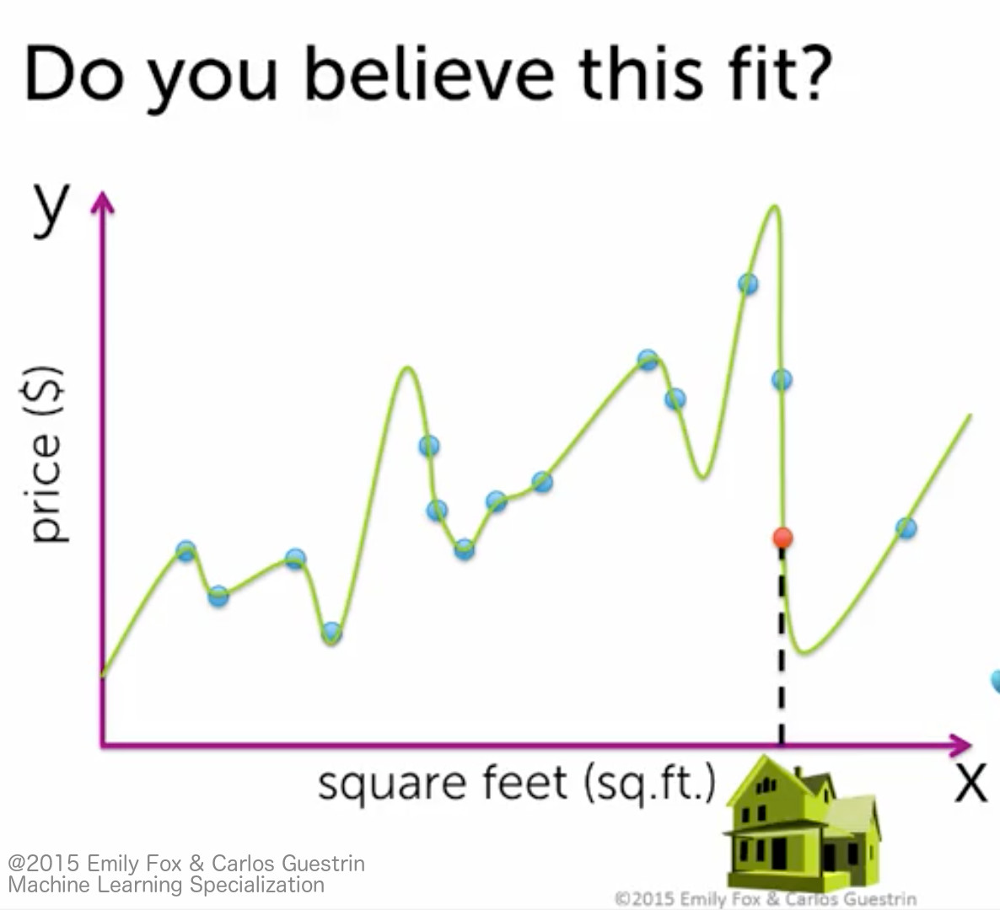

### [Machine Learning Foundations: A Case Study Approach](https://www.coursera.org/learn/ml-foundations/home/welcome)
Created by: University of Washington

# Week 2: Regression: Predicting House Prices
* [Course](#course)
* [Quiz](#quiz)
* [IPython Notebook](#ipynb)

# Course
想要預測自己的房子可以賣多少，我們可以從附近的房子的買賣紀錄來推估

利用這些房子的特徵 (features)，例如坪數、房間數、樓層等等，找出跟自己房子相近的，來推估售價

### 不好的solution:
這邊我們簡化問題，只選擇一個feature - 坪數，來推估房子的售價

#### Solution 1: 選擇附近一模一樣坪數的房子
很難找到一模一樣的

#### Solution 2: 在一定範圍內，例如正負5坪來選擇附近的房子
也許符合的仍然不多，但最大的缺點是**我們捨棄了範圍外的所有房子所能提供的資訊**

## Linear Regression
我們想找到一條線，能夠描述坪數($x$):房價($y$)的對應關係

### 問題在於要怎麼定義最佳的線?

可以透過讓**RSS (residual sum of squares)**最小來找到

也就是所有資料點到這條線的距離 (residual)總和 (sum)要最小，平方是為了消除正負號來呈現距離

當這條線找出來後，以後我們只要將房子的features代進$x$，就能得到推估的售價$y$了

## Overfitting
#### 既然RSS越小越好，那不要用直線了，我們用曲線(polynomial funciton)來讓RSS更小?
透過提升model的複雜度，我們可以在**"已經存在"的資料**上的準確率越來越高 (RSS越來越低)

這是我們想要的，但是若為了在"已經存在"的資料上達到非常高的準確率，而將model過度複雜化

反而會**傷害到預測"新"資料的準確率，這個現象叫做overfitting**

*__Additional:__ 提升model複雜度後的polynomial funciton，仍然屬於linear regression的範疇*

原因是可以透過非線性轉換，在更高維空間上做線性回歸，參考:

* [機器學習筆記-非線性轉換](http://beader.me/2014/08/30/nonlinear-transformation/)
* [廣義線性模型觀點：統計迴歸分析(REGRESSION)的基本原理與結構](http://molecular-service-science.com/2012/09/12/statistics-regression/)

#### 我們在尋找能夠描述資料的那條線的時候，需要的是代表資料"趨勢"的那條線
現在的問題是，model的RSS太高沒有代表性，RSS太低又有可能是overfitting所導致的

為了讓model的RSS夠低又不至於overfitting，可以**在訓練model時將資料分成training、testing兩部份**

## Traing / Testing Split
將"已經存在"的資料依比例分成兩部分，一個是訓練用的資料，另一個是測試用的資料

#### 關鍵點在於，測試用的資料我們故意將$y$遮起來假裝不知道 (模擬將來要預測的資料)
* Training Error: 用訓練資料去找出不同複雜度下的model，這些model的RSS稱為training error
* Testing Error: 將測試資料的$x$代入訓練資料找出的model，看看跟正確答案(剛才遮起來的$y$)差了多少，稱為testing error

結果會發現，一開始當training error越來越小(model複雜度越來越高)的時候，testing error也跟著降低

但是**到了某一個點後，testing error反而開始上升，這就是出現了overfitting**

因此我們可以用testing error來推估這個model對將來要預測的資料的準確度

## Adding More Features
上面的例子只有將坪數做為feature來預測房價，**"理論上"**若我們的提供的資訊(feature)越多，model就可以越精準

至於到底要選擇多少features來使用，在之後的regression course會再詳述

*__Note:__ 在加入features的時候，linear regression的model會提升到更高維度的空間*

# Quiz
* 找出哪張圖overfitting
* RSS的意義
* 看圖描述regression model的截距和係數 (簡單回歸、多項式回歸)
* Training / testing error的關係
* Features越多越好?

# IPython Notebook
目標: 預測房價

## Course
#### 1. 將test data的RMSE (平均error)和max error做比較，可以看出dataset中明顯有outlier存在
#### 2. 像zipcode、floors等string類型的data為什麼可以放到regression model裡去跑?
把coefficients印出來，看起來這類的data是**被flatten成個別的features**

所以像是floors總共有5種，就變成5個features，給值用0、1表示屬於哪個feature來調整coefficients

#### 3. 試圖用train完的model預測一個超級豪宅，出來的結果很難說到底是否正確
因為在train model的時候dataset並沒有這類型的豪宅

## Assignment
#### 1. 主要練習SFrame的操作
#### 2. 加入更多的features來train model
這邊的結果，更多features的model有較高的準確率

#### 3. 使用RMSE做為評估誤差的方法
其實和RSS是一樣的概念，但在描述上更加直覺 ([RSS VS RMSE](http://stats.stackexchange.com/questions/206274/relationship-between-rmse-and-rss))
