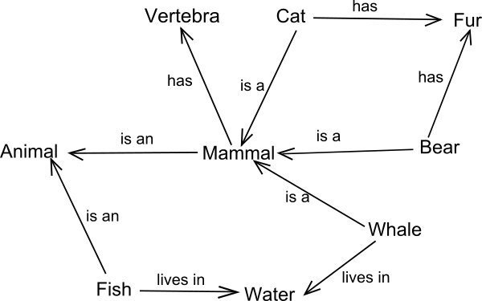
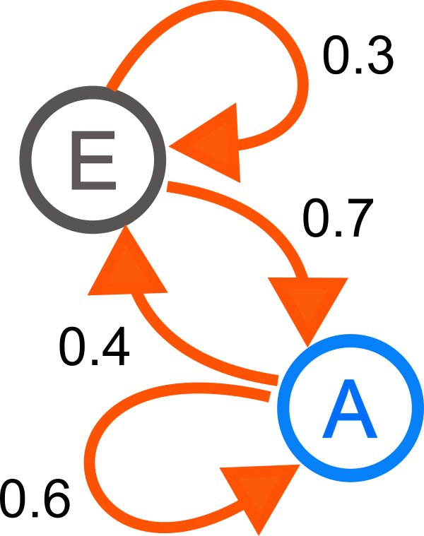

# 重點筆記: 綜觀人工智慧 - 人工智慧的過去、現在，和未來
台灣資料科學年會 - 人工智慧與機器學習在推薦系統上的應用

講者: 林守德(台大資工系教授)

### Agenda

* [人工智慧的定義與歷史](#history)
* [人工智慧現在的發展與應用](#now)
* [人工智慧的未來: 從機器學習到機器發明](#future)
* [Q & A](#q-and-a)

## 人工智慧的定義與歷史
### 人工智慧的定義
#### 首先要<mark>定義什麼是智慧</mark>

字典上的定義略而不談，從實務面的觀點來看，智慧是能夠:

1. 跟世界**互動** (觀察、了解，並對人事物進行反應)
2. 找到**最佳**的解決辦法
3. **推論**(為什麼做這個決定)以及**規劃**
4. **學習**以及**調適**

*__Note:__ 以上幾點，已有許多技術能"分別"達到，但"同時"達到仍舊非常困難*

*以AlphaGO為例，它能找到"最佳"的下法，卻不能明確推論(解釋)為什麼要這樣下*

#### 接著我們可以從兩種不一樣的角度來<mark>定義人工智慧</mark>
1. Strong AI

   電腦**擁有**智慧 (產生智慧的方式跟人類相似)

2. Weak AI

   電腦**展現**出有智慧的外顯行為 (看起來像有智慧)
   
*__Note:__ 現在主流的研究方向是Weak AI，見接下來的歷史部分*

### 人工智慧的歷史

* Before 1960: 起源
    * 電腦發明
    * [達特茅斯第一屆AI會議](https://en.wikipedia.org/wiki/Dartmouth_Conferences) (不是那種數百人參與的conference，僅由幾位重量級的與會者組成)
* 1950 ~ 1960: 啟蒙
    * Turing Test
    * [Asimov: Three Laws](https://en.wikipedia.org/wiki/Three_Laws_of_Robotics) (科幻電影常提到)
    * 第一個下西洋棋的程式
    * 第一個AI programming language: [LISP](https://en.wikipedia.org/wiki/Lisp_(programming_language))
* 1960 ~ 1970: 獲西方政府重視
    * 美國投入大量資金研究，前景一片看好 (學者認為數十年內電腦將能真正擁有智慧、勝任所有人類能做的工作)
    * 第一個交談程式: [ELIZA](https://en.wikipedia.org/wiki/ELIZA)
* 1970 ~ 1980: AI的冬天
    * 進展遇到瓶頸 (問題複雜度太高，電腦encode人類的知識太慢)
    * [Chinese Room Argument](https://en.wikipedia.org/wiki/Chinese_room): 這個實驗質疑電腦能擁有Strong AI，實驗中對電腦問中文問題，電腦其實不懂中文和問題的意思，但可以透過搜尋來做正確的回答，即所謂的AI根本不具備人類的思考能力，只像是一本很大的問答手冊)
* 1980 ~ 1990: AI的第二個冬天 (專家系統的迅速崛起和沒落)
    * 利用預先寫好的大量規則，建立類似人類專家的AI (在不同領域有大量專家系統開始建置、商業化)
    * 沒落原因: 仍需要各領域專家手動建立、無法通用、沒有太多的技術突破 (只要有專家願意慢慢建，誰都可以做，不值錢)
* After 1996: AI研究再度流行
    * <mark>多數學者放棄Strong AI，往Weak AI靠攏</mark> (e.g. 搜尋引擎、語音辨識)
    * 網路的普及讓data蒐集變得容易
    * 電腦的計算能力非比從前

#### 和其它領域的研究相比，AI的研究很特別的是: 動機幾乎都建立在"競賽"上 (AI vs AI、AI vs 人類)

* AI vs AI

  DARPA Grand Challenge (自動車橫越沙漠)、Loebner Prize (誰最像真人在聊天，至今無人贏得獎金，Siri講沒幾句就知道是AI)、RoboCup (機器人足球賽，也有跟真人比，但目前連小孩都很難贏)、ACM KDD Cup (Data Mining & ML)
  
* AI vs 人類

  Deep Blue (跟人下西洋棋)、IBM Watson (跟人比賽知識問答)、AlphaGO (跟人下圍棋)

## 人工智慧現在的發展與應用
### 人工智慧的發展
實現AI的技術重點可以大致分為以下4個方面:

#### 1. Knowledge Representation
方法有很多種，取決於將來如何"使用"知識，例如:

* Logical Representations (和人一樣用邏輯)
  
  $$ \forall x, King(x) \cap Greedy(x) \rightarrow Evil(x) $$

* Semantic Networks / graphs

  
  From Wikipedia
  
#### 2. (Machine) Learning
從現有的資料，建構一個系統能做出最佳的決定

數學上就是透過input $X$，想要<mark>"學習"一個函數$f$</mark>，讓$f(X)$能夠得到我們要的結果$Y$，例如:

* X: X光照片 / Y: 是否得癌症 (Classification)
* X: 金融新聞 / Y: 股票指數 (Regression)
* X: 很多人的照片 / Y: 相似的照片一起 (Clustering)

#### 3. Planning
為了達成特定目的，Agent根據環境做出相對應的行動，例如買機票

**Markov Decision Process**

A simple two-state Markov chain from WikiPedia

#### 4. Search and Optimization
在許多可能性中，找出最好的選擇，例如下棋(最有可能勝利的一步)、足球(最有可能得分的行動)、知識問答(最有可能是正確的答案)

能夠被model成最佳化的問題(最困難的地方)，基本上AI就有解，有解之後關鍵在於搜尋與最佳化的**速度**

### 人工智慧的應用
目前主流的應用，例如:

1. 推薦系統
2. 物聯網(IoT)
3. [SOLOMO(Social, Local, Mobile)](http://wiki.mbalib.com/zh-tw/SoLoMo) (智慧導遊、Nike+GPS、廣告看板)
4. 零售 & E-commence(智慧倉儲、運輸最佳化、商品追蹤...etc.)

## 人工智慧的未來: 從機器學習到機器發明
### 未來兩大研究走向
1. 達成更多超越人類的成就 (預測更精準、決策更正確)
2. 達成原本對人類而言就很容易的任務 (視覺、自然語言等等)

Moravec's Paradox ([Wiki](https://en.wikipedia.org/wiki/Moravec's_paradox))

* 對人類很簡單的事情，對電腦來說可能很難
    * 肢體和眼協調(爬樓梯、踢足球)
    * 嘲諷和幽默
* 對人類很難的事情，對電腦來說可能很簡單
    * 大量的記憶、運算
    * 複雜的邏輯推論

### 從學習到發明 (Learning -> Discovery)
學習是正常人在生活中都能體驗的經驗，但是發現、發明是特殊人群在特殊時空下的產物

現在機器在許多方面已經能夠幫助人類，甚至自己有發明的能力，扮演的角色可以分成:

1. Scientist (數學、物理、天文...etc.)
2. Detective (例如在Social Network中發現特殊的nodes、unseen links...etc.)

### Weak AI的時代已經來臨
硬是要電腦跟人類產生一樣的智慧(Strong AI)是正確的方向嗎?

一開始人們想飛，就先從模仿鳥開始，但是始終沒有成功，直到最後發明了飛機才實現了飛行的夢想 (很明顯它跟鳥一點都不像)

Weak AI是目前主流的研究趨勢:

$$ \text{Big Data} + \text{Knowledge Representation} + \text{ML} = \text{Weak AI} $$

### <mark>講者對於AI未來的三個預測</mark>
1. 人工智慧革命 (平凡的工作將被機器取代)
2. 決策角色的翻轉
    * 早期 - 電腦: 提供報表 / 人類: 做出決策
    * 中期 - 電腦: 提供建議 / 人類: 選擇決策 (例如搜尋引擎，我們的選擇其實已經被電腦filter過，電腦已經部分左右我們的決策)
    * 近期 - 人類: 設計決策程式 / 電腦: 自動決策 (例如High speed trading，要在0.000幾秒做出決定，人沒辦法做，對手也是電腦)
3. 從機器學習到機器發明 (不久的將來，許多科學新知將由AI發現)
    
   Machine Memorizing -> Learning -> Discovering

## Q & A
### 問題: 在處理有x卻沒有y的問題，該怎麼解決?
一般來說怎麼解決是case by case，例如:

1. 使用unsupervised learning
2. 抽樣去標記y -> semi-supervise learning
3. 用類似的資料集的y，透過轉換函數轉成我們目標變數y (transfer learning)

### 問題: Data Mining, AI, Machine Learning, Deep learning的關係性？相同或不同處？
AI是目標，是比較大的集合

Data Driven(透過資料學東西)只是其中的一種實現方法 (Data Mining + Machine Learning)

也可能完全不需要data，例如專家系統

Deep Learning是Machine Learning的一種技巧

#### 其它講者的看法:
看法一(某講座):

* 機器學習：透過資料及其特徵來訓練模型 (train model)
* 深度學習：透過資料來建構模型及其適合的特徵 (train model & feature)

看法二(林軒田，從ML的觀點看其它topic):

* vs Data Mining
    * 若感興趣的property相同，DM=ML
    * 若感興趣的property相關，DM和ML可以互相幫助
    * 傳統的DM主要在增進large database的計算效率，但<mark>現在DM和ML已經漸漸難以區分</mark>
* vs Statistics
    * Statistics是實現ML的"其中一種"方法
* vs AI
    * ML是實現AI的"其中一種"方法

