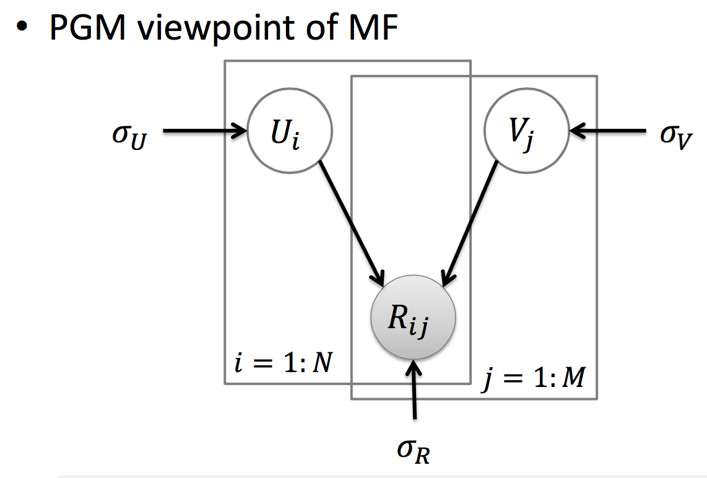
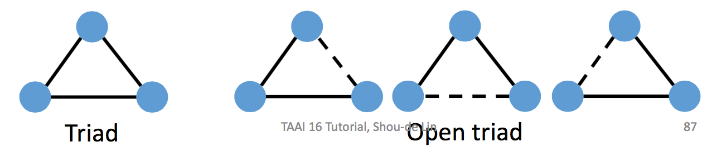

# 重點筆記: 推薦系統方法
台灣資料科學年會 - 人工智慧與機器學習在推薦系統上的應用

講者: 林守德(台大資工系教授)

### What is a good recommender system?
1. 個人化
2. 多樣性 (推薦5個很類似的東西，即使推薦成功，user可能也只會買一個。例如買尿布推薦奶瓶、奶嘴、嬰兒床 > 推薦五個牌子的奶瓶)
3. 避免無效推薦 (買過哈利波特1-5，不需要特別推薦6也會買)

### Inputs/Outputs of a Recommendation System
* Given (兩類至少要有一類才能做):
    1. Users給items的ratings
        * Explicit ratings (直接有給items評分)
        * Implicit ratings (e.g. 有瀏覽過的items的紀錄，雖然不確定是否是喜歡，但至少有關聯)
    2. User features (e.g. 偏好的電影類型) & Item features (e.g. 電影的描述)
    3. (非必要) User/User Relationships (可以improve quality)
* Predict:
    * 預測任何user在任何item上的**rating**
    * 對個別的user給出items推薦排名 (**ranking**) 

# Types of Recommender Systems
* [Content-based Recommendation (CBR)](#cbr)
* [Collaborative Filtering](#collaborative) - <mark>目前最主流的方法</mark> (Amazon, Netflix...etc.)，實務上最常見的是[MF model](#mf)
* [Other solutions](#other)
* [Evaluating Recommendation Systems](#evaluating)
* [Advanced Issues](#advanced)

## Content-based Recommendation (CBR)
**Content-based的意思:**

從個別user出發，根據此user的features及各item自己的features去推薦 (資料為[前述的第二類](#given)，不需要此user對items的ratings)

例如我們有:

* User features (e.g. user的profile、過往偏好的統計...etc.)
* Item features (e.g. 演員、類型、文字描述...etc.)
* (Optional) Items的平均ratings (e.g. IMDB分數，協助過濾爛片)

就可以做推薦

*__Note:__ 類似search engine的運作方式，user輸入的keyword就好像user的偏好，各documents有一組代表自己的keywords (features)*
    
### Vector Space Model
將features用vector表示，計算兩個vector的距離就可以看出它們有多接近 (某電影的vector和user的偏好vector的距離)
$$d=(x_1,x_2,...,x_N),\,x_i\text{ is "importance" of term i}$$
例如，若電影的所有keywords有 (good, best-selling, drama, romantic, exam)，要決定一部電影的keyword vector有兩種方式

1. Using binary existence of words
   
   有出現就value就為1，否則為0，例如某部電影的描述有出現good和drama，就可以用$(1,0,1,0,0)$來代表它

2. [TF-IDF](#https://en.wikipedia.org/wiki/Tf%E2%80%93idf)

   考慮到每個keyword描述該電影的能力不一樣，給予經過權重計算的value (而非單純使用1/0)
   
#### 計算兩個vector有多接近
1. Dot product similarity
2. Cosine Similarity (normalized dot product): $\frac{A \cdot B}{\left|A\right|\left|B\right|}$

### 優缺點分析
* 優點
    * User independence，不需要其它user的資料
    * 易於解釋
    * 加入新的items很容易 (前提是這些items有足夠的content做feature extraction)
* 缺點
    * 有的items難抓features (e.g. 影片、音樂，沒有描述)
    * Keywords可能無法代表item (不夠精準、不同items有很像的keywords)
    * 如果新user的features不夠就沒辦法推薦
    * <mark>可能推薦許多相似的東西</mark> (Redundancy是這個方法主要的缺點)

## Collaborative Filtering (CF)
**Collaborative的意思:**

推薦**和你最像的人**喜歡的items (資料為其它users給items的ratings，也就是[前述的第一類](#given))

Given (implicit ratings中，1為有看過 / 0為沒看過):

*from 人工智慧與機器學習在推薦系統上的應用, 林守德*

### CF models
* Memory-based CF (下面兩者做法一樣，只是從不同角度出發)
    * [User-based CF](#user-based)
    * [Item-based CF](#item-based)
* Model-based CF
    * <mark>[Matrix Factorization](#mf)</mark> (解決Memory-based CF的缺點，實務上最常見，因此這邊花較多篇幅介紹)
* [Limitations](#limitations)

### User-based CF
找出跟target user - $u$，最接近的$N(u)$個users，以這些users的ratings去預測target user的rating
$$r_{u,i}=\bar{r}_u+\frac{\sum_{v\in{N(u)}}sim(u,v)(r_{v,i}-\bar{r}_v)}{\sum_{v\in{N(u)}}sim(u,v)}$$
$$\bar{r}_u:\text{Average of ratings of user}\,u$$

*from 人工智慧與機器學習在推薦系統上的應用, 林守德*

### Item-based CF
計算方法同User-based，只是改從item的角度出發

*from 人工智慧與機器學習在推薦系統上的應用, 林守德*

這邊算出來和User-based一樣都是2.33只是剛好

## Matrix Factorization (MF)
解決Memory-based CF的問題: **實務上，資料中有八成以上的ratings是問號也不奇怪** (不是每個用戶都看過每部電影，以及願意留下rating)

讓我們把先前Users對Movies的ratings評分表當作矩陣$R$，很明顯地，$R$中會有很多的missing data (問號的部分)

這邊有一個重要的假設是[low rank approximation](https://en.wikipedia.org/wiki/Low-rank_approximation)(i.e. <mark>$rank(R) << min\{M, N\}$</mark>)

*參考: [link1](https://www.zhihu.com/question/28630628/answer/80090557), [link2](http://blog.csdn.net/zouxy09/article/details/24972869)*

 
意思就是，$R$中的資料相依性非常強 (e.g. 一個user對某部電影的評分，大致可以由其它相近的users給這部電影的評分推得)

透過這個假設，我們的目標是將$R$分解成$U^TV$

* $U$為users matrix，總共有$N$個users，每個user用dimensions $K$的vector代表
* $V$為movies matrix，總共有$M$部movies，每部movie用dimensions $K$的vector代表

<mark>只要能夠求出$R\approx U^TV$的$U$和$V$，我們就可以:</mark>

1. 推得$R$中的所有missing data
2. 判斷兩個user或movie的相似程度 (代表users (movies)的vector，稱為**latent factor**，若很接近，我們可以說它們**很像**)

### 從不同觀點看MF
#### 1. MF as Neural Network (NN)

*from 人工智慧與機器學習在推薦系統上的應用, 林守德*

可以想成一層的NN

#### 2. PMF: MF as Probabilistic Graphical Model (PGM)

*from 人工智慧與機器學習在推薦系統上的應用, 林守德*

也是一個機率模型

### Learning in MF
* Stochastic gradient descent (SGD)
    * 由於不需要closed-form solutions，容易推廣到其它MF extensions
    * 真正要找到最佳解，可能要跑很久 (跑到一定目標就停)
* Alternating least squares (ALS)
    * 需要closed-form solutions，因此沒有SGD應用這麼廣 (大部份的問題都沒有)
    * 允許平行運算
* Variational expectation maximization (VEM) - 這邊沒有多著墨

*__Note:__ SGD和ALS在驗證的時候，都需要特別注意regularization parameters ($\lambda$)的調整 -> 通常我們必須跑很多次MF model*

#### Extensions of MF
* 矩陣$R$可以被分解成$U^TU, U^TVU, UVW, ...$
* SVD++
* Non-negative MF (NMF)
* Tensor factorization (TF), [Factorization machines (FM)](#fm)
* Bayesian PMF (BPMF)
* Poisson factorization (PF)

#### Applications of MF
* Recommender systems (推薦)
* Filling missing features (類似推薦問題，可以變成矩陣拆解，填空格的case)
* Clustering
* Link prediction (e.g. 看兩個人是不是朋友，是的為1)
* Community detection
* Word embedding
* Word2Vec is actually an MF

#### CF的限制
* 沒用到users和items的features
    * 解: Extensions of MF中的[Factorization machines (FM)](#fm)
* 在cold start situation時效果不佳
    * 解: Transfer learning

## Other solutions
* Restricted Boltzmann Machines
    * Deep Learning應用在recommendation
* Clustering-based recommendation
    * 將users分群，找出每個group最高分的items當作這個group的推薦
    * 有效，但較缺乏個人化
* Association rule based recommendation
    * Item1通常會和Item2一起購買 -> 當買Item1的時候推薦Item2
    * 容易實作，但缺乏個人化
* Random-walk based recommendation (Graph-Based model)
    * 將users和items的關係建立network
    * Random-walk，找出最有可能reach的items

## Evaluating Recommendation Systems
* Accuracy of predictions (預測的ratings有多接近實際ratings)
    * Mean absolute error (MAE)
    * Normalized mean absolute error (NMAE)
    * Root mean squared error (RMSE)
* Relevancy of recommendations (推薦的items是否為users有興趣(相關)的)
    * 推薦的items裡面，實際是相關的數量
    * 實際相關的items裡面，有被推薦的items的數量
* Ranking of recommendations (推薦的rankings是否接近實際的rankings)
    * Discounted cumulative gain (DCG)
    * Spearman’s rank correlation
    * Kendall’s tau

## Advanced Issues
1. [Recommendation with ratings and features](#fm)
2. [Handling Cold Start](#cold-start)
3. [Using Social information in Recommendation](#social)
4. [Implicit Recommendation](#implicit)
5. [Location-based Recommendation](#location)
6. [Explaining the Recommendation Outputs](#explaining)

### Issue 1: Recommendation with ratings and features
**解: Factorization Machine (FM):**

轉換成regression問題，avaliable且有lib可以使用

### Issue 2: Handling Cold Start
**解: 從相關的領域transfer information過來**

例如:

* Movies -> Music
* Pop music -> Jazz music
* Taiwan movies -> US movies
* ...

做法:

* Sharing Latent Features of users / items
    * 需要users和 (或)items有overlap
* Transferring rating patterns
    * 不需要overlap

### Issue 3: Using Social information in Recommendation
可以分成三種:

*from 人工智慧與機器學習在推薦系統上的應用, 林守德*

#### 1. Social Context Alone
* 連結預測
* Network structure
    * 封閉的triad通常是朋友
    * 開放的triad可以當作朋友推薦

 *from 人工智慧與機器學習在推薦系統上的應用, 林守德*

#### 2. Memory-Based Social Recommendation
將$N(u)$做改變，加入了social matrix $T$的資訊

#### 3. Model-Based Social Recommendation
加入額外的regularization term到MF model

*from 人工智慧與機器學習在推薦系統上的應用, 林守德*

### Issue 4: Implicit Recommendation
**解: Bayesian Personalized Ranking –MF (BPR-MF) -> minimize pairwise ranking** (應該有lib可使用)

直接的ratings通常不好拿到，但是可以從瀏覽、購買紀錄等資訊預測

### Issue 5: Location-based Recommendation
* 從user的GPS traces，推薦旅遊地點
* 推薦最佳化的路徑
* 從現在地點，根據別人資料推薦去哪玩
* ...

### Issue 6: Explaining the Recommendation Outputs
附帶解釋的推薦效果較佳 (<mark>推薦 -> 說服</mark>)

e.g. 我推薦xxx因為你女朋友喜歡

越複雜的model效果越好，but越難解釋 (deep Learning怎麼解釋? 其實可以隨便找理由，反正users也不知道真正的原因)
