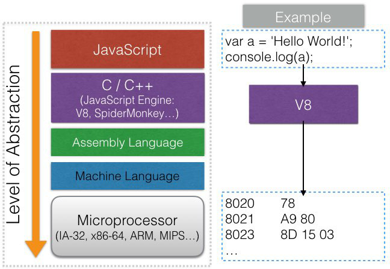
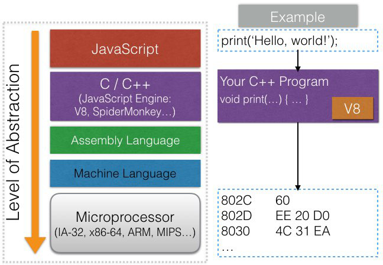

# V8: The JavaScript Engine
from: [Learn and Understand NodeJS](https://www.udemy.com/understand-nodejs/learn/v4/overview)

# Outline
* [從JavaScript到Machine Language](#intro)
* [JavaScript Engines and The ECMAScript Specification](engine)
* [V8 Under the Hood](#v8)
    * [Adding Features to JavaScript](#features)

## <a name="intro"></a>從JavaScript到Machine Language


1. 我們寫好JavaScript code
2. 交給JavaScript engine (**本身是以C++實作**)，例如V8 (Chrome)或SpiderMonkey (Firefox)

    JavaScript engine再根據platform的microprocessor架構，例如x86或ARM

3. 轉換成machine language

## <a name="engine"></a>JavaScript Engines and The ECMAScript Specification
如上所提，JavaScript engine是用來將JavaScript code轉換成machine language

為了讓各組織、團體自行建立的JavaScript engines (e.g. V8、SpiderMonkey)之間保持相容性

這些engines的實作必須要遵守所謂**JavaScript的標準: ECMAScript Specification**

舉例來說，我們可以查閱ES6的標準: [ECMAScript® 2015 Language Specification](http://www.ecma-international.org/ecma-262/6.0/)

理論上我們可以在任何符合這項標準的JavaScript engine上，放心的執行ES6的JavaScript code

## <a name="v8"></a>V8 Under the Hood
下載[V8](https://developers.google.com/v8/)的source code來幫助我們了解上述觀念


使用Git來下載: [說明](https://github.com/v8/v8/wiki/Using%20Git)

#### Step 1. 安裝[depot-tools](http://www.chromium.org/developers/how-tos/install-depot-tools)
記得`export` path，例如我將depot-tools放在`~`下

```bash
$ export PATH=~/depot_tools:"$PATH"
```

#### Step 2. 抓取V8 source code

```bash
$ fetch v8
$ cd v8
```

接著可以使用[Visual Studio Code](https://code.visualstudio.com/)來檢視C++的code

### <a name="features"></a>Adding Features to JavaScript
V8 engine有一個很重要的特性，它**可以embedded在其它C++ program中**

一般我們在寫JavaScript的code的時候，會遵守ECMAScript的標準

但是利用V8 engine的這個特性，我們可以自己寫一個C++ program，裡面實作ECMAScript沒有的function，甚至syntax

然後再將V8 engine包進program，這樣我們就可以寫標準 + 自訂語法的JavaScript code了



#### Example
我們要增加一個內建的`function`叫做`print` (不在ES標準中)

自訂的C++ Program (以V8 source code中的`samples/shell.cc`為例):

```c++
#include <include/v8.h> // 把V8 engine包進來
...
// Bind the global 'print' function to the C++ Print callback.
global->Set(
  v8::String::NewFromUtf8(isolate, "print", v8::NewStringType::kNormal)
      .ToLocalChecked(),
  v8::FunctionTemplate::New(isolate, Print));
...

// The callback that is invoked by v8 whenever the JavaScript 'print' function is called.
void Print(...) {
  // 自訂的實作
}
```

JavaScript Program:

```javascript
print('hello'); // 自訂的function

// Output
hello
```
