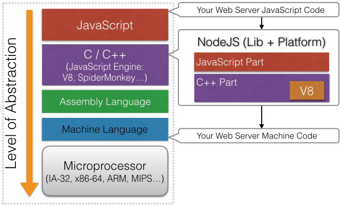
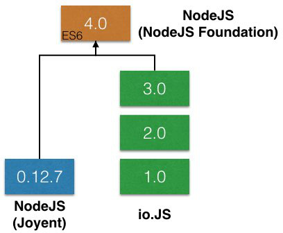

# The Node Core
from: [Learn and Understand NodeJS](https://www.udemy.com/understand-nodejs/learn/v4/overview)

# Outline
* [What Does Javascript Need to Manage a Server?](#server)
* [NodeJS要如何做到?](#nodejs)
* [Version and History](#version)

## <a name="server"></a>What Does Javascript Need to Manage a Server?
以下是標準ECMAScript沒有規範，但是若想作為server，必須要具備的能力:

1. 有良好的方法組織、管理code，讓它們可以容易被維護和重複利用
2. 處理檔案 (以及stream)
3. 處理database
4. 和網路溝通
5. 接收從client來的request及發送response
6. 處理需要花費較長時間的工作

之後在各章節會陸續看到NodeJS是怎麼去實現這些需求的

## <a name="nodejs"></a>NodeJS要如何做到?


NodeJS為了滿足作為server所需要的能力，它既是library也是platform，下載[source code](https://github.com/nodejs/node)來看，可以大致分成兩個部分

### 1. C++ Part (V8 + feature)
* `/deps`

    一些NodeJS的dependencies，例如V8 engine就在裡面

* `/src`
    主要的code (NodeJS的feature)都放在這裡，可以看到在`node.h`的一開頭:

    ```c++
    #include "v8.h"
    ```

### 2. JavaScript Part
放在`/lib`，裡面都是`.js`的JavaScript code，主要有兩個目標:

1. 作為wrapper，讓我們更容易去使用C++ part的feature，以`zlib.js`為例:

    ```javascript
    const binding = process.binding('zlib'); // bind到C++的zlib (在/deps中)
    
    // 包裝起來讓我們更容易使用
    binding.Z_MIN_WINDOWBITS = 8;
    ...
    ```
    
2. 作為library，事先定義好許多常用方法，例如`util.js`

## <a name="version"></a>Version and History


一開始是由Joyent這家公司開發及維護，後來因為跟不上V8 engine更新的速度

有另一個分支io.JS出現，最後兩者合併成立NodeJS基金會，統一版本

因此我們會看到NodeJS裡有許多dependencies (例如[libuv](https://github.com/joyent/libuv))，屬於[Joyent](https://github.com/joyent)的project

*__Additional:__ Node.js ECMAScript compatibility tables [http://node.green](http://node.green)*
