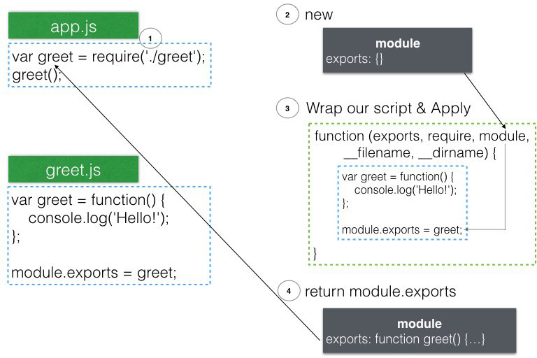
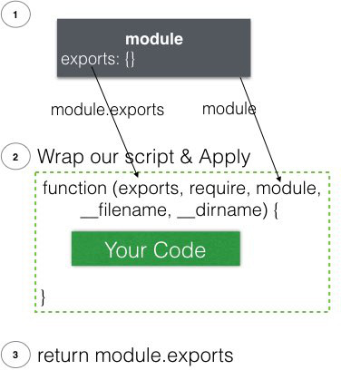

# Modules, Exports, and Require
from: [Learn and Understand NodeJS](https://www.udemy.com/understand-nodejs/learn/v4/overview)

雖然module的概念在其它語言很普遍，但是JavaScript在ES6之前，沒有相關的標準

所以NodeJS實作了[CommonJS]()的Modules

*__Note:__ CommonJS就像是ECMAScript，也是一套"標準"，目的是讓JavaScript的application可以走出browser*

# Outline
* [Let's Build a Module](#start)
* [How Do Node Modules Really Work?: module.exports and require](#how)
    * [用圖來說明](#image)
    * [index.*](#index)
    * [require(*.json)](#json)
* [Module Patterns](#patterns)
    * [取代module.exports](#replace)
        * [Module._cache](#cache)
        * [Revealing Module Pattern](#revealing)
    * [增加properties到module.exports](#add)
* [exports vs module.exports](#exports)
* [Requiring Native (Core) Modules](#core)

## <a name="start"></a>Let's Build a Module
#### Example 1
`greet.js`:

```javascript
console.log('Hello!');
```

`app.js`:

```javascript
require('./greet.js'); // 也可以去掉.js，直接使用require('./greet')
```

執行:

```bash
$ node app.js
Hello!
```

#### Example 2 (Error)
`greet.js`:

```javascript
var greet = function() {
    console.log('Hello!');
};
```

`app.js`:

```javascript
require('./greet');
greet();
```

執行:

```bash
$ node app.js
ReferenceError: greet is not defined
```

這是遵守預期的設計，module應該封裝良好，不會影響其它module的execution context

**除非我們明確宣告想要這樣做 (export)**

#### Example 3
`greet.js`:

```javascript
var greet = function() {
    console.log('Hello!');
};

module.exports = greet;
```

`app.js`:

```javascript
var greet = require('./greet'); // return './greet.js'中的module.exports object
greet();
```

執行:

```bash
$ node app.js
Hello!
```

## <a name="how"></a>How Do Node Modules Really Work?: module.exports and require
從`var greet = require('./greet.js');`開始，`require`是一個function

位於`module.js`

#### Part 1 (`require` function)
```javascript
function require(path) { // 這邊path: './greet.js'
    ...
    return self.require(path);
}
```

```javascript
// Module是一個function constructor
Module.prototype.require = function(path) { // 重點: 所有繼承Module的objects都會有require這個function
    ...
    return Module._load(path, this, /* isMain */ false);
};
```

#### Part 2 (`new`一個`Module` object)
```javascript
Module._load = function(request, parent, isMain) {
    ...
    var module = new Module(filename, parent); // 重點: 我們建立的.js檔案是如何變成module的
    // 執行完後我們有一個module object，它的property - exports現在是empty object {}
    ...
    tryModuleLoad(module, filename); // 見part 3
    // 現在module.exports已經被設為greet function
    
    return module.exports;
};
```

#### Part 3 (真正執行我們的script，並將結果assign到`module.exports`)
```javascript
function tryModuleLoad(module, filename) {
    ...
    module.load(filename);
}

Module.prototype.load = function(filename) {
    ...
    // 不是.js的檔案需要明確指定副檔名，否則預設為.js
    var extension = path.extname(filename) || '.js';
    if (!Module._extensions[extension]) extension = '.js';
    // 呼叫預先定義在Module._extensions的function
    Module._extensions[extension](this, filename);
};
```

```javascript
Module._extensions['.js'] = function(module, filename) {
  var content = fs.readFileSync(filename, 'utf8'); // 讀取script檔案
  module._compile(internalModule.stripBOM(content), filename); // 重點: 將script透過V8 compile、執行
};
```

```javascript
Module.prototype._compile = function(content, filename) {
    ...
    // 重點: 我們寫的script會先被wrap起來，包成一個function
    var wrapper = Module.wrap(content); // 見snippet
    var compiledWrapper = vm.runInThisContext(wrapper, ...
    // 現在compiledWrapper是一個function，以這邊為例，內容:
    // (function (exports, require, module, __filename, __dirname) {
    // var greet = function() {
    //     console.log('Hello!');
    // };
    // 
    // module.exports = greet;
    // });
    ...

    var args = [this.exports, require, this, filename, dirname];
    return compiledWrapper.apply(this.exports, args); // 重點: 執行wrapper function
    // 現在greet function已經被assign到module.exports
};
```

Snippet - `Module.wrap`:

```javascript
NativeModule.wrap = function(script) {
    // script是我們寫的script內容，前後包起來變成IIFE後return
    return NativeModule.wrapper[0] + script + NativeModule.wrapper[1];
};

NativeModule.wrapper = [
    '(function (exports, require, module, __filename, __dirname) { ',
    '\n});'
];
```

#### Part 4
回到`app.js`

```javascript
var greet = require('./greet.js'); // './greet.js'中的greet function
greet(); // 執行
```

### <a name="image"></a>用圖來說明


### <a name="index"></a>`index.*`
在source code裡面可以看到，若`require`的時候找到的是folder

會再去看看這個folder下有沒有`index.*` (一樣`.js`優先)

在應用上，對於比較大的module來說，不可能把全部code寫在一個檔案中

因此通常會將module切成多個檔案，放在同一個folder底下，然後用`index.js`去作為進入點，例如: 

* `app.js`
* `greet/`
    * `index.js`
    * `english.js`
    * `spanish.js`
    * `greeting.json`

```javascript
// app.js
var greet = require('./greet');

greet.english();
greet.spanish();
```

### <a name="json"></a>`require(*.json)`
將json作為JavaScript的module使用，常出現在configuration，或是data的載入

`james.json` (純粹的json內容，沒有JavaScript code):

```json
{
    "name": "James",
    "age": 28
}
```

`app.js`:

```javascript 
var student = require('./james.json');
console.log(student); // { name: 'James', age: 28 }
```

## <a name="patterns"></a>Module Patterns
### <a name="replace"></a>取代`module.exports`
#### Pattern 1 (simple case):
```javascript
// greet.js
module.exports = function() {
    console.log('Hello!');
}

// app.js
var greet = require('./greet');
greet(); // Hello!
```

#### Pattern 2 (用自訂的function constructor建立object後取代):
`greet.js`:

```javascript
function Greetr() {
    this.greeting = "Hello!";
}
Greetr.prototype.sayHi = function() {
    console.log(this.greeting);
}

module.exports = new Greetr();
```

`app.js`:

```javascript
var greet = require('./greet.js');
greet.sayHi(); // Hello!
```

這邊我們討論一個問題，若多次呼叫`require('./greet.js')`的話

會建立多個`Greetr` object嗎?

### <a name="cache"></a>`Module._cache`
```javascript
Module._load = function(request, parent, isMain) {
    ...
    var cachedModule = Module._cache[filename];
    if (cachedModule) {
        return cachedModule.exports;
    }
    ...
    Module._cache[filename] = module;
    ...
}
```
可以看到，當module被載入後，會被cache起來，下次需要的時候就不再重新載入而是return cache的module

做個實驗:

```javascript
var greet = require('./greet.js'); // 第一次跑'./greet.js'中的script，new出object
greet.sayHi(); // Hello!
greet.greeting = "Hola!";

var greet2 = require('./greet.js'); // 直接return cache，所以是同一object
greet2.sayHi(); // Hola!
```

*__Note:__ 即使`require('./greet.js')`跨檔案呼叫多次，也只會跑一次script*

#### Pattern 3 (自訂的function constructor):
`greet.js`:

```javascript
function Greetr() {
    this.greeting = "Hello!";
}
Greetr.prototype.sayHi = function() {
    console.log(this.greeting);
}

module.exports = Greetr;
```

`app.js`:

```javascript
var Greetr = require('./greet.js');
var greet = new Greetr();
greet.sayHi(); // Hello!
```

### <a name="revealing"></a>Revealing Module Pattern
只expose想讓外部access的variables和functions

`greet.js`:

```javascript
var greeting = "Hello!";
function greet() {
    console.log(greeting);
}

module.exports = {
    greet: greet
}
```

`app.js`:

```javascript
// 沒辦法直接access 'greet.js'的greeting variable，被封裝起來了
var greet = require('./greet.js').greet;
greet(); // Hello!
```

### <a name="add"></a>增加properties到`module.exports`
#### Pattern 4:
```javascript
// greet.js
module.exports.greet = function() {
    console.log('Hello!');
}

// app.js
var greet = require('./greet').greet;
greet(); // Hello!

// 等同
// var greetr = require('./greet');
// greetr.greet();
```

## <a name="exports"></a>exports vs module.exports
`exports`只是**做為`module.exports`的shorthand**，但容易誤用



**結論: 一律使用`module.exports`，盡量不要用`exports`**

#### Example 1 (誤用: 取代`exports`)
```javascript
// greet.js
exports = function() {
    console.log('Hello!');
};

// app.js
var greet = require('./greet.js'); // return empty object
greet(); // Error
```

將`exports`指向另一object，原本的`module.exports`仍然指向一個empty object

在`require`時return的便是該empty object

#### Example 2 (正確用法: 在`exports`上加properties)
```javascript
// greet.js
exports.greet = function() {
    console.log('Hello!');
};

// app.js
var greet = require('./greet.js').greet;
greet(); // Hello!
```

`exports.greet`相當於`module.exports.greet` (做為shorthand)，沒問題

## <a name="core"></a>Requiring Native (Core) Modules
在source code中:

```javascript
Module._load = function(request, parent, isMain) {
    ...
    if (NativeModule.nonInternalExists(filename)) {
        return NativeModule.require(filename);
    }
    ...
}
```

可以看到會試圖載入內建的core module，列表: [NodeJS API](https://nodejs.org/api/)

```javascript
var util = require('util'); // 不需要'./'

var name = 'James';
var greeting = util.format('Hello %s', name);
util.log(greeting); // 9 Feb 15:49:23 - Hello James
```

*__Tips:__ 盡量避免把自己的module取名跟core module一樣，雖然使用`'./'`可以載入自己的module，不過容易混淆*


