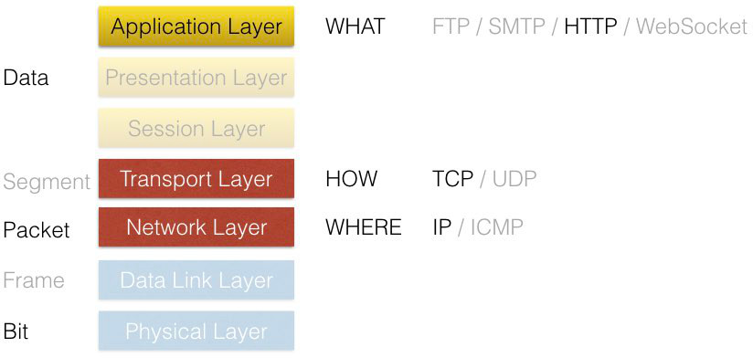
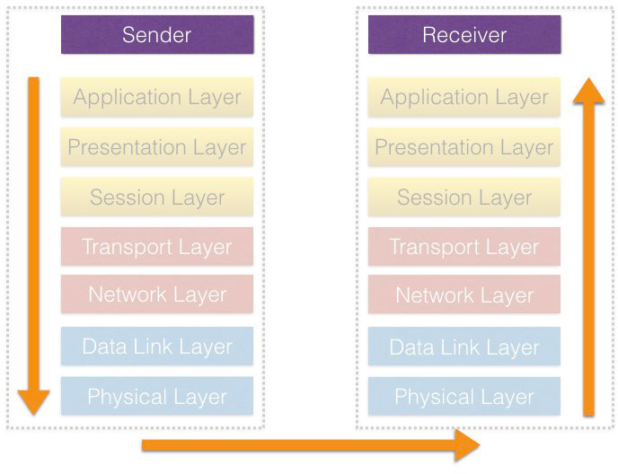
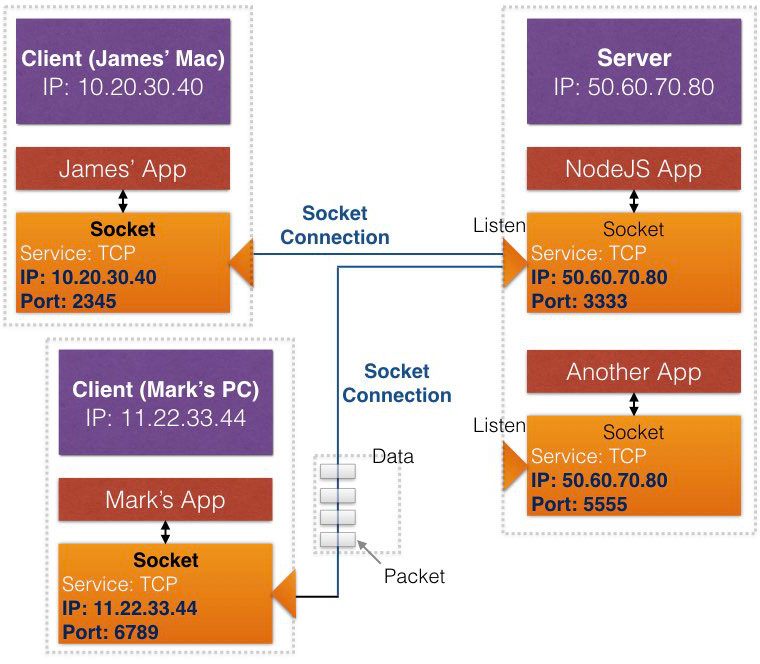

# HTTP and being a Web Server
from: [Learn and Understand NodeJS](https://www.udemy.com/understand-nodejs/learn/v4/overview)

# Outline
* [Conceptual Aside: OSI model, Protocols and Socket](#concept)
    * [OSI model & Protocols](#osi)
    * [Socket](#socket)
* [NodeJS Http Server](#http-server)
    * [Html Template](#template)
    * [Streams and Performance](#streams)
* [Routing](#routing)

## <a name="concept"></a>Conceptual Aside: OSI model, Protocols and Socket
### <a name="osi"></a>OSI model & Protocols
先用[OSI model](https://en.wikipedia.org/wiki/OSI_model)來看一些常見的protocol是在做什麼:



這邊我們只看感興趣的地方:

1. Application Layer: 資料要用**"什麼格式"**去送

    例如HTTP protocol，我們有規定的request method (`GET`、`POST`)、request header等等
    
2. Transport Layer: 資料要用**"什麼方法"**去送

    例如TCP protocol，可以保證資料到達的順序以及在傳送過程中，內容沒有遺失
    
3. Network Layer: 資料要送到**"什麼地方"**

    例如IP
    
#### Example
若以一個單向的資料傳送來說，就是從sender的application，從最上層一路encoding然後送到Receiver

當receiver收到的時候，從最下層一路decoding最後到達Receiver的application



### <a name="socket"></a>Socket
以一個application的開發者來說，我們要傳資料不會自己實作OSI model中的每一層細節

而是通常會用**"socket"**的方式直接使用相關API

對application來說，**socket就是一組IP + port的位址**

*__Port:__  對TCP/IP的架構來說，一台deivce會有多個application，但是只有一組IP，要識別各個application，每個application會需要一組獨一無二的port (Transport Layer)，類似IP是路名，port是門牌號碼*

我們擁有local socket、指定remote socket，然後就可以建立連線，資料丟過去socket或從socket接回來即可



通常做為server的application，會**持續監聽一個固定的socket (IP + port)**

而其它clients，在需要發出request到server application的時候，系統會**分配一個隨機的port**來建立socket

## <a name="http-server"></a>NodeJS Http Server
```javascript
var http = require('http');

var server = http.createServer(function (req, res) {
  // Client Socket (req.connection: net.Socket)
  console.log(`[Port] Local:${req.connection.localPort} / Remote: ${req.connection.remotePort}`);

  res.writeHead(200, {'Content-Type': 'text/plain'});
  res.end('Hello World\n');
});
server.listen(1337, '127.0.0.1'); // Server Socket

// Output:
    // Chrome
    [Port] Local:1337 / Remote: 49759
    // Terminal (curl)
    [Port] Local:1337 / Remote: 49761
```

要建立http server，先使用`http` module來建立instance

然後呼叫`listen`開始監聽

以這個例子而言，server的port固定是1137，而clients的port分別為49759和49761

### <a name="template"></a>Html Template
示範什麼是html templates:

```javascript
http.createServer(function(req, res) {
    ...
    var html = fs.readFileSync(__dirname + '/index.htm', 'utf8');
    var message = 'Hello world...';
    html = html.replace('{Message}', message);
    ...
}).listen(1337, '127.0.0.1');
```

這邊是用`replace`的方式，自己實作一個陽春的html template，實際上有許多template engines可以使用 (e.g. [Pug](https://pugjs.org/api/getting-started.html)、[EJS](http://www.embeddedjs.com/))

#### Additional: Outputting JSON
除了html以外，JSON也是我們常用來傳送的資料格式

**這在NodeJS中又特別適合，因為JSON的格式就是以JavaScript的object做為基礎概念設計的**

例如要傳送一個JavaScript object，簡單使用`JSON.stringify(obj)`將object轉成string後傳送

### <a name="streams"></a>Streams and Performance
上面的例子使用`fs.readFileSync`來載入html file

**若檔案較大或request的數量很多，就會被卡住**

由於request是stream，我們可以使用pipe的方式來避免:

```javascript
http.createServer(function(req, res) {
    res.writeHead(200, { 'Content-Type': 'text/html' });
    
    fs.createReadStream(__dirname + '/index.htm').pipe(res);
}).listen(1337, '127.0.0.1');
```

這邊只是呈現一個概念，說明我們可以怎麼樣利用stream的特性

比較複雜的需求 (e.g. 需要動態調整stream內容) 會在之後討論

## <a name="routing"></a>Routing
自己用if / else的方式實作:

```javascript
http.createServer(function(req, res) {
    if (req.url === '/') {
        ...
    } else if (req.url === '/api') {
        ...
    } else {
        ...
    }
}).listen(1337, '127.0.0.1');
```

這邊只是簡單呈現routing的概念，這種方式當routing的結構變得很複雜的時候就不堪用了

之後會在討論
