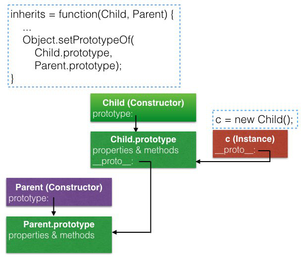
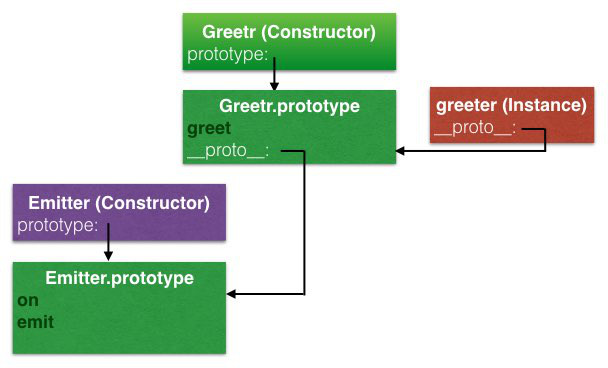
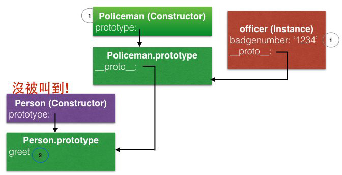
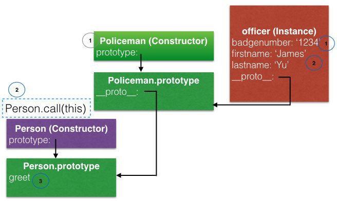

# Events and the Event Emitter
from: [Learn and Understand NodeJS](https://www.udemy.com/understand-nodejs/learn/v4/overview)

1. 說明NodeJS的`EventEmitter`以外

2. **說明了NodeJS的`inherits`的原理** (為了讓我們自己的實作去繼承`EventEmitter`)

    在使用`inherits`時，要注意可以在`Child`的constructor中，使用`Parent.call(this)`這個pattern
    
3. 使用ES6的`class`同樣可以去繼承`EventEmitter` (看個人喜好)

    `super`可以取代`Parent.call(this)`這個pattern

# Outline
* [Conceptual Aside: Events](#event)
* [Event Emitter (自己實作)](#simple-impl)
* [The Node Event Emitter (用native core module)](#eventemitter)
    * [Magic String](#magic-string)
* [Inheriting From the Event Emitter (`util.inherits`)](#inherits)
    * [Pattern: `Parent.call(this)`](#inherits-pattern)
* [Inheriting From the Event Emitter (`class`)](#class)
* [Export Your Event Emitter](#export)

## <a name="event"></a>Conceptual Aside: Events
先前提到，NodeJS可以分成兩個部分: C++和JavaScript

* System Events (C++ Core): `libuv`

    **真正的event**，例如檔案讀寫、網路存取

* Custom Events (JavaScript Core): `EventEmitter`

    包裝C++部分的event，讓我們可以方便實作這些event的callback

## <a name="simple-impl"></a>Event Emitter (自己實作)
在JavaScript中，listener會是function

以下為自己實作一個簡單的event emitter:

`emitter.js`:

```javascript
function Emitter() {
    this.events = {};
}

Emitter.prototype.on = function(type, listener) {
    this.events[type] = this.events[type] || []; // 初始化，為每個type建立array來存放listener
    this.events[type].push(listener);
}

Emitter.prototype.emit = function(type) {
    if (this.events[type]) {
        this.events[type].forEach(function(listener) { // 依序呼叫每個listener
            listener();
        });
    }
}

module.exports = Emitter;
```

`app.js`:

```javascript
var Emitter = require('./emitter');

var emtr = new Emitter();
emtr.on('greet', function() {
    console.log('Somewhere, someone said hello.');
});

emtr.on('greet', function() {
    console.log('A greeting occurred!');
});

console.log('Hello!');
emtr.emit('greet');

// Output
Hello!
Somewhere, someone said hello.
A greeting occurred!
```

## <a name="eventemitter"></a>The Node Event Emitter (用native core module)
使用native core module: `event.js`，看source code，整體架構跟我們自行實作的是一樣的

**這邊直接將`require('./emitter')`改成`require('events')`**

```javascript
var Emitter = require('events'); // Native Core Module

var emtr = new Emitter();
emtr.on('greet', function() {
    console.log('Somewhere, someone said hello.');
});

emtr.on('greet', function() {
    console.log('A greeting occurred!');
});

console.log('Hello!');
emtr.emit('greet');
```

### <a name="magic-string"></a>Magic String
下面這個pattern用來解決event name是hardcode的問題

`config.js`:

```javascript
module.exports = {
    events: {
        GREET: 'greet',
        FILESAVED: 'filesaved'
    }
};
```

`app.js`:

```javascript
var Emitter = require('events');
var eventConig = require('./config').events;

var emtr = new Emitter();
emtr.on(eventConig.GREET, function() {
    console.log('Somewhere, someone said hello.');
});

emtr.on(eventConig.GREET, function() {
    console.log('A greeting occurred!');
});

console.log('Hello!');
emtr.emit(eventConig.GREET);
```

## <a name="inherits"></a>Inheriting From the Event Emitter (`util.inherits`)
Native core module: `util.inherits`，可以跟:

* [`Object.create`](/JavaScript/Understanding the Weird Parts/5 - Building Objects.md#object-create)
* [`extends`](/JavaScript/ES6 For Everyone/15 - Classes.md#extends)

做比較

```javascript
// `util.js`
exports.inherits = function(ctor, superCtor) {
    ...
    Object.setPrototypeOf(ctor.prototype, superCtor.prototype); // 注意是將.prototype的__proto__設過去
}
```



#### Example
```javascript
var Emitter = require('events');
var util = require('util');

function Greetr() {
    this.greeting = 'Hello world!';
}

util.inherits(Greetr, Emitter);

Greetr.prototype.greet = function() {
    console.log(this.greeting); // 2
    this.emit('greet'); // 3 from inherits
}

var greeter = new Greetr();

greeter.on('greet', function() {
    console.log('Someone greeted!'); // 4
});

greeter.greet(); // 1

// Output
Hello world!
Someone greeted!
```



#### Example (pass data)
```javascript
var Emitter = require('events');
var util = require('util');


function Greetr() {
    this.greeting = 'Hello world!';
}

util.inherits(Greetr, Emitter);

Greetr.prototype.greet = function(data) {
    console.log(this.greeting + ': ' + data);
    this.emit('greet', data);
}

var greeter1 = new Greetr();

greeter1.on('greet', function(data) {
    console.log('Someone greeted!: ' + data);
});

greeter1.greet('OMG');

// Output
Hello world!: OMG
Someone greeted!: OMG
```

### <a name="inherits-pattern"></a>Pattern: `Parent.call(this)`
確保不只繼承`Parent.prototype`的內容，在`Parent`的constructor中的也要

問題:

```javascript
var util = require('util');

function Person() {
	this.firstname = 'James';
	this.lastname = 'Yu';
}
Person.prototype.greet = function() {
	console.log('Hello ' + this.firstname + ' ' + this.lastname);
}

function Policeman() {
	this.badgenumber = '1234';
}

util.inherits(Policeman, Person);
var officer = new Policeman();
officer.greet();

// Output
Hello undefined undefined // Why?
```

這是因為:



還記得constructor function中的`this`是指向將被return的empty object嗎?

因此我們可以使用下面這個pattern (在source code中常見):

```javascript
...
function Policeman() {
    Person.call(this); // 加入這行
    this.badgenumber = '1234';
}
...
// Output
Hello James Yu
```

原理:



## <a name="class"></a>Inheriting From the Event Emitter (`class`)
在ES6中，可以直接使用`class`而不透過`util.inherits`

一樣意思:

```javascript
var EventEmitter = require('events');
var util = require('util');

class Greetr extends EventEmitter {
	constructor() {
		super(); // 不需要EventEmitter.call(this)
		this.greeting = 'Hello world!';
	}

	greet(data) {
		console.log(this.greeting + ': ' + data);
		this.emit('greet', data);
	}
}

var greeter = new Greetr();

greeter.on('greet', function(data) {
	console.log('Someone greeted!: ' + data);
});

greeter.greet('James');
```

## <a name="export"></a>Export Your Event Emitter
這邊以使用`class`為例 (`util.inherits`)當然也可以:

`greetr.js`:

```javascript
var EventEmitter = require('events');

module.exports = class Greetr extends EventEmitter { // class expression
	constructor() {
		super();
		this.greeting = 'Hello world!';
	}

	greet(data) {
		console.log(this.greeting + ': ' + data);
		this.emit('greet', data);
	}
}
```

`app.js`:

```javascript
var Greetr = require('./greetr.js');
var util = require('util');

var greeter = new Greetr();

greeter.on('greet', function(data) {
	console.log('Someone greeted!: ' + data);
});

greeter.greet('James');
```
