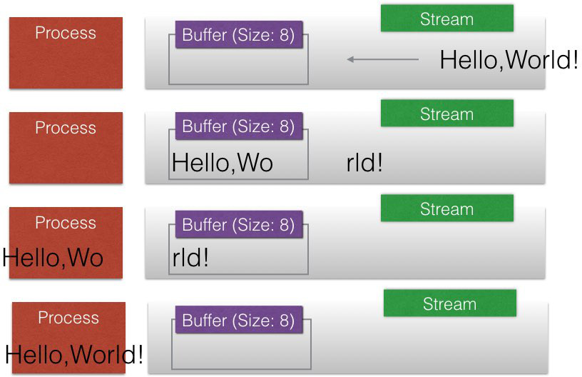
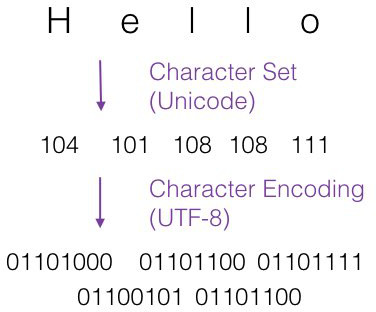
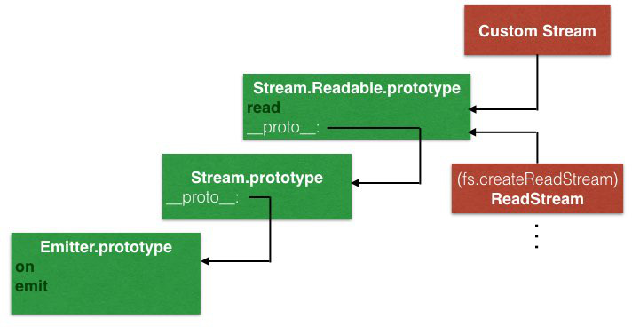
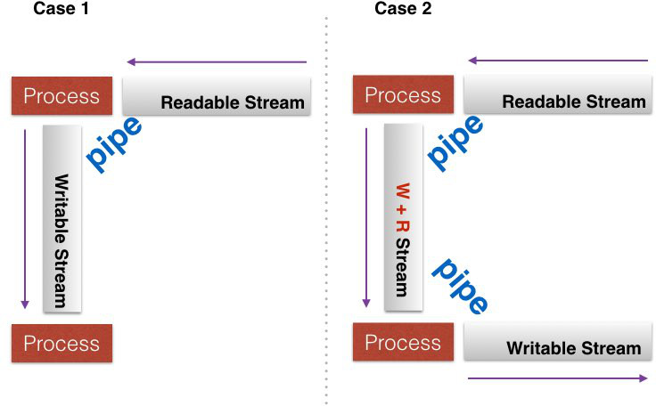

# Asynchronous Code, libuv, The Event Loop, Streams, Files, and more…
from: [Learn and Understand NodeJS](https://www.udemy.com/understand-nodejs/learn/v4/overview)

# Outline
* [libuv, The Event Loop, and Non-Blocking Asynchronous Execution](#libuv)
    * [Javascript is Synchronous](#js-synchronous)
    * [Event Loop](#event-loop)
* [Conceptual Aside: Streams and Buffers](#stream-buffer)
* [Conceptual Aside: Binary Data, Character Sets, and Encodings](#encoding)
* [Buffers](#buffer)
    * [ES6 Typed Arrays](#typed-array)
* [Files and fs](#fs)
* [Streams](#stream)
* [Conceptual Aside: Pipes](#concept-pipe)
* [Pipes](#pipe)
    * [Chaining](#chaining)

## <a name="libuv"></a>libuv, The Event Loop, and Non-Blocking Asynchronous Execution
### <a name="js-synchronous"></a>Javascript is Synchronous
說NodeJS是完全asynchrounous的架構，不完全對，**NodeJS中JavaScript的部分(V8 engine)是synchronous**

### <a name="event-loop"></a>Event Loop
參考:

1. [JavaScript Event Loop (在browser中)](/JavaScript/Understanding the Weird Parts/1 - Execution Contexts and Lexical Environments.md#thread)

2. [非同步程式碼之霧：Node.js 的事件迴圈與 EventEmitter](https://simeneer.blogspot.tw/2016/09/nodejs-eventemitter.html) By Simen

可以想成NodeJS在執行的時候分成兩個部分:

1. JavaScript (V8)
2. C++ (libuv)

同時在運行

libuv就是我們所謂的event loop的機制實現的地方，負責跟OS溝通以及決定現在哪個JavaScript callback要放到V8中執行

*__重點__: JavaScript的部分都是synchronous依序執行的，也就是說在某個callback中做繁重的工作會block住整個V8 engine*

#### libuv的[source code](https://github.com/libuv/libuv)
[`core.c`](https://github.com/libuv/libuv/blob/v1.x/src/win/core.c):


```c++
int uv_run(uv_loop_t* loop, uv_run_mode mode) { // uv_loop_t就是event loop
    ...
    while (r != 0 && loop->stop_flag == 0) {
    ...
```

## <a name="stream-buffer"></a>Conceptual Aside: Streams and Buffers
* *__Buffer:__ A temporary holding spot for data being moved from one place to another.*
* *__Stream:__ A sequence of data made available over time. (e.g. Download vs Stream Movie).*



## <a name="encoding"></a>Conceptual Aside: Binary Data, Character Sets, and Encodings
* *__Binary Data:__ Data stored in binary (e.g. 0101010110...)*

* *__Character Sets:__ A representation of characters as numbers (e.g. Unicode / ASCII)*

* *__Encodings:__ How characters are stored in binary*



**在encoding的部分，JavaScript在ES6以前沒辦法處理，所以NodeJS有自己的實作: `Buffer`**

## <a name="buffer"></a>Buffers
[官方doc](https://nodejs.org/api/buffer.html)

#### Example
```javascript
var buf = new Buffer('Hello', 'utf-8'); // Default: utf-8

// In memory: binary data
console.log(buf);
    // <Buffer 48 65 6c 6c 6f>

// 還原
console.log(buf.toString());
    // Hello

// Character sets
console.log(buf.toJSON());
    // { type: 'Buffer', data: [ 72, 101, 108, 108, 111 ] }
console.log(buf[2]);
    // 108
```

`Buffer`的大小固定:

```javascript
// 在上面new Buffer('Hello')的部分，就決定了size是5，且已經滿了
buf.write('GG'); // override
console.log(buf.toString()); // GGllo
```

### <a name="typed-array"></a>ES6 Typed Arrays
JavaScript在ES6之後可以處理encoding

```javascript
var buffer = new ArrayBuffer(8); // 8 bytes
var view = new Int32Array(buffer); // 32bits = 4bytes -> 2 integers
view[0] = 5;
view[1] = 15;
console.log(view);

view[2] = 30; // 不會error，但是沒用
```

*__Note:__ NodeJS還是用自己的`Buffer`實作在處理encoding*

## <a name="fs"></a>Files and fs
#### Synchronous
```javascript
var fs = require('fs');

var greet = fs.readFileSync(__dirname + '/greet.txt', 'utf8');
console.log(greet); // string

var greet = fs.readFileSync(__dirname + '/greet.txt');
console.log(greet); // buffer (TypedArray)
```

有沒有提供encoding，會影響return的是buffer還是string，source code:

```javascript
// fs.js
if (encoding) buffer = buffer.toString(encoding);
return buffer;
```

Synchronous可以利用在像是讀取configuration file等場合

#### Asynchrounous
```javascript
var fs = require('fs');

var greet = fs.readFile(__dirname + '/greet.txt',
    // error-first callback (standard pattern): null if no error
    function(err, data) {
        console.log(data); // buffer
    }
);

console.log('Hello');

// Output
Hello // 不會block住main thread
<Buffer 48 65 6c 6c 6f 20 77 6f 72 6c 64 21 0a 49 27 6d 20 4a 61 6d 65 73 2e>
```

Source code:

```javascript
// fs.js
const binding = process.binding('fs'); // C++

fs.readFile = function(path, options, callback_) {
    ...
    var context = new ReadFileContext(callback, encoding);
    var req = new FSReqWrap();
    req.context = context;
    ...
    binding.open(req); // 只將callback設起來，真正的工作是交由C++ part處理
}
```

以上不管是synchronous或是asynchrounous，都是**一次將所有data讀取到buffer裡面**

**若data的size很大，buffer會爆炸，因此這種情況需要使用stream的架構來處理**

## <a name="stream"></a>Streams
Data依照buffer的大小被切成多個"chunks"

*__Chunk:__ A piece of data being sent through a stream*

### 架構
從source code來看

`stream.js`:

```javascript
const EE = require('events');

util.inherits(Stream, EE);
Stream.Readable = require('_stream_readable'); // r
Stream.Writable = require('_stream_writable'); // w
Stream.Duplex = require('_stream_duplex'); // r + w
...
```

*__Note:__ 這邊readable和writable指的是以NodeJS的觀點，例如從browser來的request是readable stream(對browser本身而言它是在write)，發送給browser的response是writable stream*

`_stream_readable.js`:

```javascript
util.inherits(Readable, Stream);
```

我們可以看出，**`stream.js`和`_stream_readable.js`都是abstract class**

真正在使用的時候，可以用相關module預設的方法，像是`fs.createReadStream`

或是自己實作，來建立stream的instance

`fs.js`:

```javascript
fs.createReadStream = function(path, options) {
  return new ReadStream(path, options);
};

util.inherits(ReadStream, Readable);
```



*__Additional:__ 要產生測試用的文字內容，可以使用: [Lorem Ipsum](http://www.lipsum.com/)*

#### Example
`greet.txt` (source file) 有60kB

Read:

```javascript
var fs = require('fs');

var readable = fs.createReadStream(__dirname + '/greet.txt', { encoding: 'utf8', highWaterMark: 16 * 1024 });
// 故意指定buffer size: 16kB，讓我們可以看出chunk的運作，不然預設buffer遠大於60kB，會一次全load

readable.on('data', function(chunk) {
	console.log(chunk.length); // 這邊為了說明chunk的概念，只印每個chunk的size
});

// Output:
16384
16384
16384
12456
```

Read + Write

```javascript
var fs = require('fs');

var readable = fs.createReadStream(__dirname + '/greet.txt', { encoding: 'utf8', highWaterMark: 16 * 1024 });
var writable = fs.createWriteStream(__dirname + '/greetcopy.txt'); // 將讀取的內容寫到這個檔案

readable.on('data', function(chunk) {
	console.log(chunk.length);
	writable.write(chunk); // 一批一批chunk寫
});
```

像這種邊一邊讀取stream的chunk，就一邊寫入另一個stream的動作很常見，我們可以不用自己實作，透過pipes來完成

## <a name="concept-pipe"></a>Conceptual Aside: Pipes
*__Pipe:__ Connecting two streams by writing to one stream what is being read from another
Pipe from a Readable stream to a Writable stream.*



**好處: 可以不用等整批資料處理完再到下一個process，適合處理流量很大的data stream，讓所有process盡量不要idle**

## <a name="pipe"></a>Pipes
`_stream_readable.js`:

```javascript
Readable.prototype.pipe = function(dest, pipeOpts) {
  var src = this;
  ...
  src.on('data', ondata);
  function ondata(chunk) { // 注意這邊是event emitter -> async的操作，有chunk進來就執行
    var ret = dest.write(chunk); // 將chunk寫到target stream
    ...
    
  return dest; // 可以做method chaining，例如stream.pipe().pipe()
```

#### Simple Example
```javascript
var fs = require('fs');

var readable = fs.createReadStream(__dirname + '/greet.txt', { encoding: 'utf8', highWaterMark: 16 * 1024 });
var writable = fs.createWriteStream(__dirname + '/greetcopy.txt');

readable.pipe(writable);
```

#### 1. Readable stream可以被attach到多個writable stream
```javascript
var fs = require('fs');

var readable = fs.createReadStream(__dirname + '/greet.txt', { encoding: 'utf8', highWaterMark: 16 * 1024 });
var writable = fs.createWriteStream(__dirname + '/greetcopy.txt');
var writable2 = fs.createWriteStream(__dirname + '/greetcopy2.txt');

readable.pipe(writable);
readable.pipe(writable2);
```

`greetcopy.txt`和`greetcopy2.txt`皆為`greet.txt`的完整copy

#### 2. `.pipe`是async的操作
```javascript
var fs = require('fs');

var readable = fs.createReadStream(__dirname + '/greet.txt', { encoding: 'utf8', highWaterMark: 16 * 1024 });
var writable = fs.createWriteStream(__dirname + '/greetcopy.txt');

readable.pipe(writable);
readable.on('end', () => {
  console.log('pipe end');
});
console.log('hello');

// Output:
hello
pipe end // (檔案copy完成)
```

### <a name="chaining"></a>Chaining
```javascript
var fs = require('fs');
var zlib = require('zlib');

var readable = fs.createReadStream(__dirname + '/greet.txt', { encoding: 'utf8', highWaterMark: 16 * 1024 });
var writable = fs.createWriteStream(__dirname + '/greetcopy.txt');

var compressed = fs.createWriteStream(__dirname + '/greet.txt.gz');
var gzip = zlib.createGzip(); // r + w stream

readable.pipe(writable);
readable.pipe(gzip).pipe(compressed);
```


